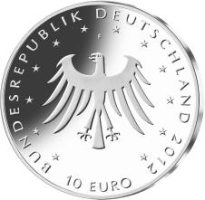
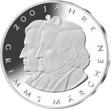
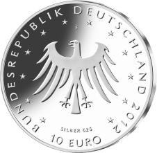

# Bekanntmachung über die Ausprägung von deutschen Euro-Gedenkmünzen im Nennwert von 10 Euro (Gedenkmünze „200 Jahre Grimms Märchen“) (Münz10EuroBek 2012-03-08)

Ausfertigungsdatum
:   2012-03-08

Fundstelle
:   BGBl I: 2012, 491

## (XXXX)

Gemäß den §§ 2, 4 und 5 des Münzgesetzes vom 16. Dezember 1999 (BGBl.
I S. 2402) hat die Bundesregierung beschlossen, zum Thema „200 Jahre
Grimms Märchen“ eine deutsche Euro-Gedenkmünze im Nennwert von 10 Euro
prägen zu lassen.

Die Auflage der Münze beträgt ca. 2 000 000 Stück, davon ca. 240 000
Stück in der Spiegelglanzqualität. Die Prägung erfolgt durch die
Staatlichen Münzen Baden-Württemberg, Prägestätte Stuttgart (F).

Die Münze wird ab dem 14. Juni 2012 in den Verkehr gebracht. Die
10-Euro-Gedenkmünze in der Stempelglanzqualität besteht aus einer
Kupfer-Nickel-Legierung (CuNi25), hat einen Durchmesser von 32,5
Millimetern und eine Masse von 14 Gramm. Die Spiegelglanzmünze besteht
aus einer Legierung von 625 Tausendteilen Silber und 375 Tausendteilen
Kupfer, hat einen Durchmesser von 32,5 Millimetern und ein Gewicht von
16 Gramm. Das Gepräge auf beiden Seiten ist erhaben und wird von einem
schützenden, glatten Randstab umgeben.

Die Bildseite zeigt das Doppelporträt der Brüder Jakob und Wilhelm
Grimm, das mit einer Umschrift anlässlich des Jubiläums umrahmt ist.

Die Wertseite der Münze zeigt einen Adler, die Umschrift
„BUNDESREPUBLIK DEUTSCHLAND 2012“ mit den zwölf Europasternen und der
Wertbezeichnung „10 Euro“ sowie dem Münzzeichen „F“ der Staatlichen
Münzen Baden-Württemberg in Stuttgart. Auf der Wertseite der Münze in
Spiegelglanzqualität ist zusätzlich die Angabe „SILBER 625“
aufgeprägt.

Der glatte Münzrand enthält in vertiefter Prägung die Inschrift:

„\*UND WENN SIE NICHT GESTORBEN SIND …\*“.

Der Entwurf der Münze stammt von dem Künstler Prof. Christian Höpfner
aus Berlin.

## Schlussformel

Der Bundesminister der Finanzen

## (XXXX)

(Fundstelle: BGBl. I 2012, 491)

*    *        
    *        

*    *        
    *        

