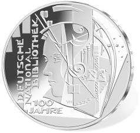
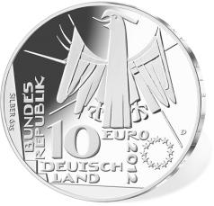

# Bekanntmachung über die Ausprägung von deutschen Euro-Gedenkmünzen im Nennwert von 10 Euro (Gedenkmünze „100 Jahre Deutsche Nationalbibliothek“) (Münz10EuroBek 2012-09-10)

Ausfertigungsdatum
:   2012-09-10

Fundstelle
:   BGBl I: 2012, 1899

## (XXXX)

Gemäß den §§ 2, 4 und 5 des Münzgesetzes vom 16. Dezember 1999 (BGBl.
I S. 2402) hat die Bundesregierung beschlossen, zum Thema „100 Jahre
Deutsche Nationalbibliothek“ eine deutsche Euro-Gedenkmünze im
Nennwert von 10 Euro prägen zu lassen.

Die Auflage der Münze beträgt ca. 1 700 000 Stück, davon ca. 210 000
Stück in Spiegelglanzqualität. Die Prägung erfolgt durch das
Bayerische Hauptmünzamt München (Prägezeichen D).

Die Münze wird ab dem 13. September 2012 in den Verkehr gebracht. Die
10-Euro-Gedenkmünze in der Stempelglanzqualität besteht aus einer
Kupfer-Nickel-Legierung (CuNi25), hat einen Durchmesser von 32,5
Millimetern und eine Masse von 14 Gramm. Die Spiegelglanzmünze besteht
aus einer Legierung von 625 Tausendteilen Silber und 375 Tausendteilen
Kupfer, hat einen Durchmesser von 32,5 Millimetern und ein Gewicht von
16 Gramm. Das Gepräge auf beiden Seiten ist erhaben und wird von einem
schützenden, glatten Randstab umgeben.

Die Bildseite zeigt ein Gesicht, das stellvertretend für die Leser in
der Bibliothek steht, sowie die Sammlungsgegenstände der Bibliothek:
Bücher und Buchstaben, binäre Zeichen für die digitale Welt und
Notenschlüssel stellvertretend für Musikalien und Tonträger.

Die Wertseite zeigt einen Adler, den Schriftzug „BUNDESREPUBLIK
DEUTSCHLAND“, Wertziffer und Wertbezeichnung, das Prägezeichen „D“ des
Bayerischen Hauptmünzamtes, die Jahreszahl 2012 sowie die zwölf
Europasterne. Auf der Wertseite der Münze in Spiegelglanzqualität ist
zusätzlich die Angabe „SILBER 625“ aufgeprägt.

Der glatte Münzrand enthält in vertiefter Prägung die Inschrift:

*    *   „BÜCHER SIND DER EINGANG ZUR WELT*                       “.

Der Entwurf stammt von dem Künstler Victor Huster aus Baden-Baden.

## Schlussformel

Der Bundesminister der Finanzen

## (XXXX)

(Fundstelle: BGBl. I 2012, 1899)

*    *        
    *        

*    *        
    *        

