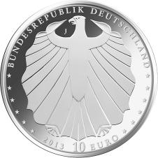

# Bekanntmachung über die Ausprägung von deutschen Euro-Gedenkmünzen im Nennwert von 10 Euro (Gedenkmünze „Schneewittchen“) (Münz10EuroBek 2013-03-21)

Ausfertigungsdatum
:   2013-03-21

Fundstelle
:   BGBl I: 2013, 709

## (XXXX)

Gemäß den §§ 2, 4 und 5 des Münzgesetzes vom 16. Dezember 1999 (BGBl.
I S. 2402) hat die Bundesregierung beschlossen, zum Thema
„Schneewittchen“ eine deutsche Euro-Gedenkmünze im Nennwert von 10
Euro prägen zu lassen. Diese Münze ist die zweite von insgesamt sechs
Ausgaben im Rahmen der in 2012 begonnenen Serie „200 Jahre Grimms
Märchen“. Am 20. Dezember 1812 erschien der erste Band der Kinder- und
Hausmärchen der Gebrüder Grimm.

Die Auflage der Münze beträgt ca. 1 500 000 Stück, davon ca. 200 000
Stück in Spiegelglanzqualität. Die Prägung erfolgt durch die
Hamburgische Münze (Prägezeichen J).

Die Münze wird ab dem 21. März 2013 in den Verkehr gebracht. Die
10-Euro-Gedenkmünze in der Stempelglanzqualität besteht aus einer
Kupfer-Nickel-Legierung (CuNi25), hat einen Durchmesser von 32,5
Millimetern und eine Masse von 14 Gramm. Die Spiegelglanzmünze besteht
aus einer Legierung von 625 Tausendteilen Silber und 375 Tausendteilen
Kupfer, hat einen Durchmesser von 32,5 Millimetern und ein Gewicht von
16 Gramm. Das Gepräge auf beiden Seiten ist erhaben und wird von einem
schützenden, glatten Randstab umgeben.

Die Bildseite greift das Hauptthema des Märchens, den
Schönheitswettbewerb und den Neid der Königin auf die Prinzessin, auf,
ohne dabei in Klischees zu verfallen. Durch die Darstellung der
populären Elemente Spiegel, Apfel und Zwerge ist das Märchen eindeutig
zu identifizieren.

Die Wertseite zeigt einen Adler, den Schriftzug „BUNDESREPUBLIK
DEUTSCHLAND“, Wertziffer und Wertbezeichnung, das Prägezeichen „J“ der
Hamburgischen Münze, die Jahreszahl 2013 sowie die zwölf Europasterne.
Auf der Wertseite der Münze in Spiegelglanzqualität ist zusätzlich die
Angabe „SILBER 625“ aufgeprägt.

Der glatte Münzrand enthält in vertiefter Prägung die Inschrift:

„SPIEGLEIN, SPIEGLEIN AN DER WAND…“.

Der Entwurf der Münze stammt von dem Künstler Bastian Prillwitz aus
Berlin.

## Schlussformel

Der Bundesminister der Finanzen

## (XXXX)

(Fundstelle: BGBl. I 2013, 709)

*    *        
    *        

*    *        
    *        

