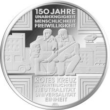
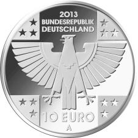
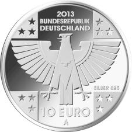

# Bekanntmachung über die Ausprägung von deutschen Euro-Gedenkmünzen im Nennwert von 10 Euro (Gedenkmünze „150 Jahre Rotes Kreuz“) (Münz10EuroBek 2013-04-25)

Ausfertigungsdatum
:   2013-04-25

Fundstelle
:   BGBl I: 2013, 1246

## (XXXX)

Gemäß den §§ 2, 4 und 5 des Münzgesetzes vom 16. Dezember 1999 (BGBl.
I S. 2402) hat die Bundesregierung beschlossen, zum Thema „150 Jahre
Rotes Kreuz“ eine deutsche Euro-Gedenkmünze im Nennwert von 10 Euro
prägen zu lassen.

Die Auflage der Münze beträgt ca. 1 500 000 Stück, davon ca. 200 000
Stück in Spiegelglanzqualität. Die Prägung erfolgt durch die
Staatliche Münze Berlin (Prägezeichen A).

Die Münze wird ab dem 11. April 2013 in den Verkehr gebracht. Die
10-Euro-Gedenkmünze in der Stempelglanzqualität besteht aus einer
Kupfer-Nickel-Legierung (CuNi25), hat einen Durchmesser von 32,5
Millimetern und eine Masse von 14 Gramm. Die Spiegelglanzmünze besteht
aus einer Legierung von 625 Tausendteilen Silber und 375 Tausendteilen
Kupfer, hat einen Durchmesser von 32,5 Millimetern und ein Gewicht von
16 Gramm. Das Gepräge auf beiden Seiten ist erhaben und wird von einem
schützenden, glatten Randstab umgeben.

Die Bildseite zeigt beispielhaft Aktionsfelder des Roten Kreuzes, vom
Rettungsdienst bis zum sozialen Engagement und nennt ferner die
weltweit anerkannten Grundsätze der Rotkreuzbewegung.

Die Wertseite zeigt einen Adler, den Schriftzug „BUNDESREPUBLIK
DEUTSCHLAND“, Wertziffer und Wertbezeichnung, das Prägezeichen „A“ der
Staatlichen Münze Berlin, die Jahreszahl 2013 sowie die zwölf
Europasterne. Auf der Wertseite der Münze in Spiegelglanzqualität ist
zusätzlich die Angabe „SILBER 625“ aufgeprägt.

Der glatte Münzrand enthält in vertiefter Prägung die Inschrift:

„AUS LIEBE ZUM MENSCHEN +“.

Der Entwurf der Münze stammt von dem Künstler Bodo Broschat aus
Berlin.

## Schlussformel

Der Bundesminister der Finanzen

## (XXXX)

(Fundstelle: BGBl. I 2013, 1246)

*    *        
    *        

*    *        
    *        

