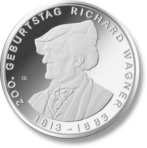
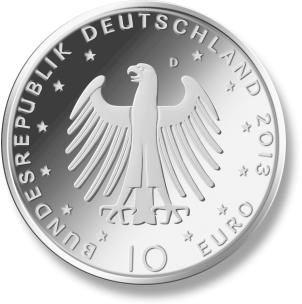
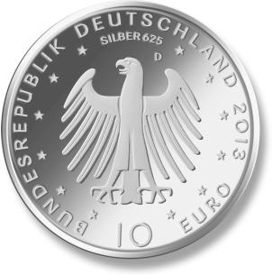

# Bekanntmachung über die Ausprägung von deutschen Euro-Gedenkmünzen im Nennwert von 10 Euro (Gedenkmünze „200. Geburtstag Richard Wagner“) (Münz10EuroBek 2013-07-09)

Ausfertigungsdatum
:   2013-07-09

Fundstelle
:   BGBl I: 2013, 2583

## (XXXX)

Gemäß den §§ 2, 4 und 5 des Münzgesetzes vom 16. Dezember 1999 (BGBl.
I S. 2402) hat die Bundesregierung beschlossen, zum Thema „200.
Geburtstag Richard Wagner“ eine deutsche Euro-Gedenkmünze im Nennwert
von 10 Euro prägen zu lassen.

Die Auflage der Münze beträgt ca. 1 500 000 Stück, davon ca. 210 000
Stück in Spiegelglanzqualität. Die Prägung erfolgt durch das
Bayerische Hauptmünzamt München (Prägezeichen D).

Die Münze wird ab dem 22. Mai 2013 in den Verkehr gebracht. Die
10-Euro-Gedenkmünze in der Stempelglanzqualität besteht aus einer
Kupfer-Nickel-Legierung (CuNi25), hat einen Durchmesser von 32,5
Millimetern und eine Masse von 14 Gramm. Die Spiegelglanzmünze besteht
aus einer Legierung von 625 Tausendteilen Silber und 375 Tausendteilen
Kupfer, hat einen Durchmesser von 32,5 Millimetern und ein Gewicht von
16 Gramm. Das Gepräge auf beiden Seiten ist erhaben und wird von einem
schützenden, glatten Randstab umgeben.

Die Bildseite zeigt eine ausdrucksstarke, fein differenzierte
Profilansicht Richard Wagners.

Die Wertseite zeigt einen Adler, den Schriftzug „BUNDESREPUBLIK
DEUTSCHLAND“, Wertziffer und Wertbezeichnung, das Prägezeichen „D“ des
Bayerischen Hauptmünzamtes, München, die Jahreszahl 2013 sowie die
zwölf Europasterne. Auf der Wertseite der Münze in
Spiegelglanzqualität ist zusätzlich die Angabe „SILBER 625“
aufgeprägt.

Der glatte Münzrand enthält in vertiefter Prägung die Inschrift:

„WANDEL UND WECHSEL LIEBT, WER LEBT“.

Der Entwurf stammt von dem Künstler Erich Ott aus München.

## Schlussformel

Der Bundesminister der Finanzen

## (XXXX)

(Fundstelle: BGBl. I 2013, 2583)

*    *        
    *        

*    *        
    *        

