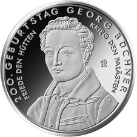
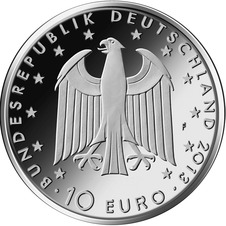
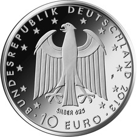

# Bekanntmachung über die Ausprägung von deutschen Euro-Gedenkmünzen im Nennwert von 10 Euro (Gedenkmünze „200. Geburtstag Georg Büchner“) (Münz10EuroBek 2014-02-28)

Ausfertigungsdatum
:   2014-02-28

Fundstelle
:   BGBl I: 2014, 249

## (XXXX)

Gemäß den §§ 2, 4 und 5 des Münzgesetzes vom 16. Dezember 1999 (BGBl.
I S. 2402) hat die Bundesregierung beschlossen, zum Thema „200.
Geburtstag Georg Büchner“ eine deutsche Euro-Gedenkmünze im Nennwert
von 10 Euro prägen zu lassen.

Die Auflage der Münze beträgt ca. 1 500 000 Stück, davon ca. 200 000
Stück in Spiegelglanzqualität. Die Prägung erfolgt durch die
Staatlichen Münzen Baden-Württemberg, Prägestätte Stuttgart
(Prägezeichen F).

Die Münze wird ab dem 10. Oktober 2013 in den Verkehr gebracht. Die
10-Euro-Gedenkmünze in der Stempelglanzqualität besteht aus einer
Kupfer-Nickel-Legierung (CuNi25), hat einen Durchmesser von 32,5
Millimetern und eine Masse von 14 Gramm. Die Spiegelglanzmünze besteht
aus einer Legierung von 625 Tausendteilen Silber und 375 Tausendteilen
Kupfer, hat einen Durchmesser von 32,5 Millimetern und ein Gewicht von
16 Gramm. Das Gepräge auf beiden Seiten ist erhaben und wird von einem
schützenden, glatten Randstab umgeben.

Die Bildseite zeigt ein Brustbild des Dramatikers in „altdeutscher
Tracht“, das seine freiheitliche revolutionäre Gesinnung ausdrückt.
Die innere Umschrift zitiert das Motto des „Hessischen Landboten“.

Die Wertseite zeigt einen Adler, den Schriftzug „BUNDESREPUBLIK
DEUTSCHLAND“, Wertziffer und Wertbezeichnung, das Prägezeichen „F“ der
Staatlichen Münzen Baden-Württemberg, Prägestätte Stuttgart, die
Jahreszahl 2013 sowie die zwölf Europasterne. Auf der Wertseite der
Münze in Spiegelglanzqualität ist zusätzlich die Angabe „SILBER 625“
aufgeprägt.

Der glatte Münzrand enthält in vertiefter Prägung die Inschrift:

„ICH BIN SO JUNG UND DIE WELT IST SO ALT“.

Der Entwurf stammt von dem Künstler Eugen Ruhl aus Pforzheim.

## Schlussformel

Der Bundesminister der Finanzen

## (XXXX)

(Fundstelle: BGBl. I 2014, 249)

*    *        
    *        

*    *        
    *        

