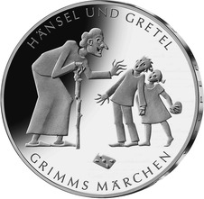
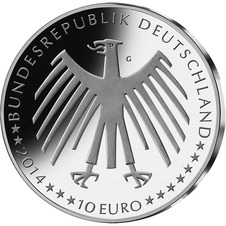
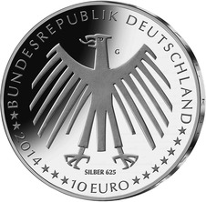

# Bekanntmachung über die Ausprägung von deutschen Euro-Gedenkmünzen im Nennwert von 10 Euro (Gedenkmünze „Hänsel und Gretel“) (Münz10EuroBek 2014-02-28/2)

Ausfertigungsdatum
:   2014-02-28

Fundstelle
:   BGBl I: 2014, 250

## (XXXX)

Gemäß den §§ 2, 4 und 5 des Münzgesetzes vom 16. Dezember 1999 (BGBl.
I S. 2402) hat die Bundesregierung beschlossen, zum Thema „Hänsel und
Gretel“ eine deutsche Euro-Gedenkmünze im Nennwert von 10 Euro prägen
zu lassen. Diese Münze ist die dritte von insgesamt sechs Ausgaben im
Rahmen der in 2012 begonnenen Serie „200 Jahre Grimms Märchen“. Am 20.
Dezember 1812 erschien der erste Band der Kinder- und Hausmärchen der
Gebrüder Grimm.

Die Auflage der Münze beträgt ca. 1 400 000 Stück, davon ca. 200 000
Stück in Spiegelglanzqualität. Die Prägung erfolgt durch die
Staatlichen Münzen Baden-Württemberg, Prägestätte Karlsruhe
(Prägezeichen G).

Die Münze wird ab dem 6. Februar 2014 in den Verkehr gebracht. Die
10-Euro-Gedenkmünze in der Stempelglanzqualität besteht aus einer
Kupfer-Nickel-Legierung (CuNi25), hat einen Durchmesser von 32,5
Millimetern und eine Masse von 14 Gramm. Die Spiegelglanzmünze besteht
aus einer Legierung von 625 Tausendteilen Silber und 375 Tausendteilen
Kupfer, hat einen Durchmesser von 32,5 Millimetern und ein Gewicht von
16 Gramm. Das Gepräge auf beiden Seiten ist erhaben und wird von einem
schützenden, glatten Randstab umgeben.

Die Bildseite stellt die Schlüsselszene des Märchens dar, in der die
Hexe die Kinder überrascht. Das Hexenhaus wird durch einen
herabgefallenen und angebissenen Lebkuchenziegel angedeutet.

Die Wertseite zeigt einen Adler, den Schriftzug „BUNDESREPUBLIK
DEUTSCHLAND“, Wertziffer und Wertbezeichnung, das Prägezeichen „G“ der
Staatlichen Münzen Baden-Württemberg, Prägestätte Karlsruhe, die
Jahreszahl 2014 sowie die zwölf Europasterne. Auf der Wertseite der
Münze in Spiegelglanzqualität ist zusätzlich die Angabe „SILBER 625“
aufgeprägt.

Der glatte Münzrand enthält in vertiefter Prägung die Inschrift:

„KNUPER, KNUPER, KNEISCHEN …“.

Der Entwurf stammt von der Künstlerin Marianne Dietz aus Berlin.

## Schlussformel

Der Bundesminister der Finanzen

## (XXXX)

(Fundstelle: BGBl. I 2014, 250)

*    *        
    *        

*    *        
    *        

