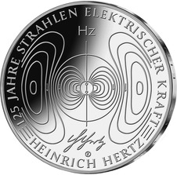
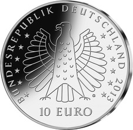
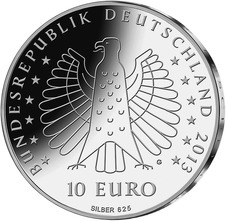

# Bekanntmachung über die Ausprägung von deutschen Euro-Gedenkmünzen im Nennwert von 10 Euro (Gedenkmünze „125 Jahre Strahlen elektrischer Kraft Heinrich Hertz“) (Münz10EuroBek 2014-02-28/3)

Ausfertigungsdatum
:   2014-02-28

Fundstelle
:   BGBl I: 2014, 251

## (XXXX)

Gemäß den §§ 2, 4 und 5 des Münzgesetzes vom 16. Dezember 1999 (BGBl.
I S. 2402) hat die Bundesregierung beschlossen, zum Thema „125 Jahre
Strahlen elektrischer Kraft – Heinrich Hertz“ eine deutsche Euro-
Gedenkmünze im Nennwert von 10 Euro prägen zu lassen.

Die Auflage der Münze beträgt ca. 1 500 000 Stück, davon ca. 200 000
Stück in Spiegelglanzqualität. Die Prägung erfolgt durch die
Staatlichen Münzen Baden-Württemberg, Prägestätte Karlsruhe
(Prägezeichen G).

Die Münze wird ab dem 21. November 2013 in den Verkehr gebracht. Die
10-Euro-Gedenkmünze in der Stempelglanzqualität besteht aus einer
Kupfer-Nickel-Legierung (CuNi25), hat einen Durchmesser von 32,5
Millimetern und eine Masse von 14 Gramm. Die Spiegelglanzmünze besteht
aus einer Legierung von 625 Tausendteilen Silber und 375 Tausendteilen
Kupfer, hat einen Durchmesser von 32,5 Millimetern und ein Gewicht von
16 Gramm. Das Gepräge auf beiden Seiten ist erhaben und wird von einem
schützenden, glatten Randstab umgeben.

Die Bildseite stellt die Entdeckung der Strahlen elektrischer Kraft an
einer Kugelfunkenstrecke (Hertzscher Dipol) dar. Die Feldlinien des
Hertzschen Dipols sind das zentrale Element der von Hertz im
Experiment nachgewiesenen Wellenausbreitung. Ergänzend wird die nach
Hertz benannte Einheit der Frequenz (Hz) sowie die Signatur des
Forschers integriert.

Die Wertseite zeigt einen Adler, den Schriftzug „BUNDESREPUBLIK
DEUTSCHLAND“, Wertziffer und Wertbezeichnung, das Prägezeichen „G“ der
Staatlichen Münzen Baden-Württemberg, Prägestätte Karlsruhe, die
Jahreszahl 2013 sowie die zwölf Europasterne. Auf der Wertseite der
Münze in Spiegelglanzqualität ist zusätzlich die Angabe „SILBER 625“
aufgeprägt.

Der glatte Münzrand enthält in vertiefter Prägung die Inschrift:

„LICHT IST EINE ELEKTRISCHE ERSCHEINUNG“.

Der Entwurf stammt von dem Künstler Othmar Kukula aus Neuhausen.

## Schlussformel

Der Bundesminister der Finanzen

## (XXXX)

(Fundstelle: BGBl. I 2014, 251)

*    *        
    *        

*    *        
    *        

