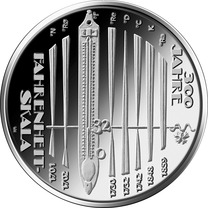
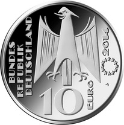
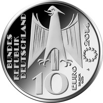

# Bekanntmachung über die Ausprägung von deutschen Euro-Gedenkmünzen im Nennwert von 10 Euro (Gedenkmünze „300 Jahre Fahrenheit-Skala“) (Münz10EuroBek 2015-06-23)

Ausfertigungsdatum
:   2015-06-23

Fundstelle
:   BGBl I: 2015, 1035

## (XXXX)

Gemäß den §§ 2, 4 und 5 des Münzgesetzes vom 16. Dezember 1999 (BGBl.
I S. 2402) hat die Bundesregierung beschlossen, zum Thema „300 Jahre
Fahrenheit-Skala“ eine deutsche Euro-Gedenkmünze im Nennwert von 10
Euro prägen zu lassen.

Die Auflage der Münze beträgt ca. 1,4 Mio. Stück, davon ca. 0,2 Mio.
Stück in Spiegelglanzqualität. Die Prägung erfolgt durch die
Hamburgische Münze (Prägezeichen J).

Die Münze wird ab dem 6. November 2014 in den Verkehr gebracht. Die
10-Euro-Gedenkmünze in der Stempelglanzqualität besteht aus einer
Kupfer-Nickel-Legierung (CuNi25), hat einen Durchmesser von 32,5
Millimetern und eine Masse von 14 Gramm. Die Spiegelglanzmünze besteht
aus einer Legierung von 625 Tausendteilen Silber und 375 Tausendteilen
Kupfer, hat einen Durchmesser von 32,5 Millimetern und ein Gewicht von
16 Gramm. Das Gepräge auf beiden Seiten ist erhaben und wird von einem
schützenden, glatten Randstab umgeben.

Die Bildseite stellt eine wissenschaftshistorische Einordnung der
Fahrenheit-Skala in die chronologische Abfolge der thermometrischen
Skalen des 18. und 19. Jahrhunderts dar. Dies gelingt gestalterisch
durch eine Komposition von Darstellungen eines Fahrenheit-Thermometers
im Kontext anderer abstrahiert dargestellter Temperaturskalen.

Die Wertseite zeigt einen Adler, den Schriftzug „BUNDESREPUBLIK
DEUTSCHLAND“, Wertziffer und Wertbezeichnung, das Prägezeichen „J“ der
Hamburgischen Münze, die Jahreszahl 2014 sowie die zwölf Europasterne.
Auf der Wertseite der Münze in Spiegelglanzqualität ist zusätzlich die
Angabe „SILBER 625“ aufgeprägt.

Der glatte Münzrand enthält in vertiefter Prägung die Inschrift:

„EIN MEILENSTEIN DER MESSTECHNIK“.

Der Entwurf stammt von dem Künstler Victor Huster aus Baden-Baden.

## Schlussformel

Der Bundesminister der Finanzen

## (XXXX)

(Fundstelle: BGBl. I 2015, 1035)

*    *        
    *        

*    *        
    *        

