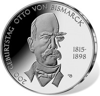
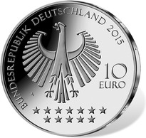
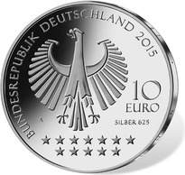

# Bekanntmachung über die Ausprägung von deutschen Euro-Gedenkmünzen im Nennwert von 10 Euro (Gedenkmünze „200. Geburtstag Otto von Bismarck“) (Münz10EuroBek 2015-06-23/3)

Ausfertigungsdatum
:   2015-06-23

Fundstelle
:   BGBl I: 2015, 1037

## (XXXX)

Gemäß den §§ 2, 4 und 5 des Münzgesetzes vom 16. Dezember 1999 (BGBl.
I S. 2402) hat die Bundesregierung beschlossen, zum Thema „200.
Geburtstag Otto von Bismarck“ eine deutsche Euro-Gedenkmünze im
Nennwert von 10 Euro prägen zu lassen.

Die Auflage der Münze beträgt ca. 1,3 Mio. Stück, davon ca. 0,2 Mio.
Stück in Spiegelglanzqualität. Die Prägung erfolgt durch die
Staatliche Münze Berlin (Prägezeichen A).

Die Münze wird ab dem 26. März 2015 in den Verkehr gebracht. Die
10-Euro-Gedenkmünze in der Stempelglanzqualität besteht aus einer
Kupfer-Nickel-Legierung (CuNi25), hat einen Durchmesser von 32,5
Millimetern und eine Masse von 14 Gramm. Die Spiegelglanzmünze besteht
aus einer Legierung von 625 Tausendteilen Silber und 375 Tausendteilen
Kupfer, hat einen Durchmesser von 32,5 Millimetern und ein Gewicht von
16 Gramm. Das Gepräge auf beiden Seiten ist erhaben und wird von einem
schützenden, glatten Randstab umgeben.

Die Bildseite zeigt ein Porträt, das in eindrucksvoller Weise die
Komplexität der Persönlichkeit Bismarcks verdeutlicht.

Die Wertseite zeigt einen Adler, den Schriftzug „BUNDESREPUBLIK
DEUTSCHLAND“, Wertziffer und Wertbezeichnung, das Prägezeichen „A“ der
Staatlichen Münze Berlin, die Jahreszahl 2015 sowie die zwölf
Europasterne. Auf der Wertseite der Münze in Spiegelglanzqualität ist
zusätzlich die Angabe „SILBER 625“ aufgeprägt.

Der glatte Münzrand enthält in vertiefter Prägung die Inschrift:

„DIE POLITIK IST DIE LEHRE VOM MÖGLICHEN“.

Der Entwurf stammt von dem Künstler Michael Otto aus Rodenbach.

## Schlussformel

Der Bundesminister der Finanzen

## (XXXX)

(Fundstelle: BGBl. I 2015, 1037)

*    *        
    *        

*    *        
    *        

