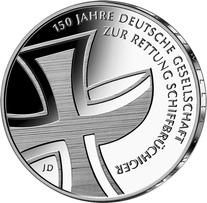
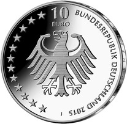
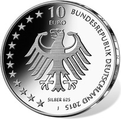

# Bekanntmachung über die Ausprägung von deutschen Euro-Gedenkmünzen im Nennwert von 10 Euro (Gedenkmünze „150 Jahre Gesellschaft zur Rettung Schiffbrüchiger“) (Münz10EuroBek 2015-06-23/4)

Ausfertigungsdatum
:   2015-06-23

Fundstelle
:   BGBl I: 2015, 1038

## (XXXX)

Gemäß den §§ 2, 4 und 5 des Münzgesetzes vom 16. Dezember 1999 (BGBl.
I S. 2402) hat die Bundesregierung beschlossen, zum Thema „150 Jahre
Gesellschaft zur Rettung Schiffbrüchiger“ eine deutsche Euro-
Gedenkmünze im Nennwert von 10 Euro prägen zu lassen.

Die Auflage der Münze beträgt ca. 1,3 Mio. Stück, davon ca. 0,2 Mio.
Stück in Spiegelglanzqualität. Die Prägung erfolgt durch die
Hamburgische Münze (Prägezeichen J).

Die Münze wird ab dem 7. Mai 2015 in den Verkehr gebracht. Die
10-Euro-Gedenkmünze in der Stempelglanzqualität besteht aus einer
Kupfer-Nickel-Legierung (CuNi25), hat einen Durchmesser von 32,5
Millimetern und eine Masse von 14 Gramm. Die Spiegelglanzmünze besteht
aus einer Legierung von 625 Tausendteilen Silber und 375 Tausendteilen
Kupfer, hat einen Durchmesser von 32,5 Millimetern und ein Gewicht von
16 Gramm. Das Gepräge auf beiden Seiten ist erhaben und wird von einem
schützenden, glatten Randstab umgeben.

Auf der Bildseite verschmelzen Hansekreuz und Rettungsboot zu einer
Einheit, die zu einer strengen, fast abstrakten Gestalt wird. Dennoch
bleiben die Kernsymbole der Rettung – Schiff und Hansekreuz – klar
erkennbar. Durch die Positionierung und den Anschnitt des Symbols
sowie die seitlich versetzte Umschrift wird auf subtile Weise ein
Hinweis auf das Element Meer gegeben.

Die Wertseite zeigt einen Adler, den Schriftzug „BUNDESREPUBLIK
DEUTSCHLAND“, Wertziffer und Wertbezeichnung, das Prägezeichen „J“ der
Hamburgischen Münze, die Jahreszahl 2015 sowie die zwölf Europasterne.
Auf der Wertseite der Münze in Spiegelglanzqualität ist zusätzlich die
Angabe „SILBER 625“ aufgeprägt.

Der glatte Münzrand enthält in vertiefter Prägung die Inschrift:

„FREIWILLIG • UNABHÄNGIG •
SPENDENFINANZIERT •“.

Der Entwurf stammt von dem Künstler Joachim Dimanski aus Halle.

## Schlussformel

Der Bundesminister der Finanzen

## (XXXX)

(Fundstelle: BGBl. I 2015, 1038)

*    *        
    *        

*    *        
    *        

