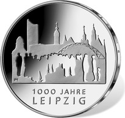
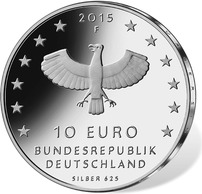

# Bekanntmachung über die Ausprägung von deutschen Euro-Gedenkmünzen im Nennwert von 10 Euro (Gedenkmünze „1 000 Jahre Leipzig“) (Münz10EuroBek 2015-06-23/5)

Ausfertigungsdatum
:   2015-06-23

Fundstelle
:   BGBl I: 2015, 1039

## (XXXX)

Gemäß den §§ 2, 4 und 5 des Münzgesetzes vom 16. Dezember 1999 (BGBl.
I S. 2402) hat die Bundesregierung beschlossen, zur Würdigung des
1 000-jährigen Jubiläums der Stadt Leipzig eine deutsche Euro-
Gedenkmünze im Nennwert von 10 Euro prägen zu lassen.

Die Auflage der Münze beträgt ca. 1,2 Mio. Stück, davon ca. 0,2 Mio.
Stück in Spiegelglanzqualität. Die Prägung erfolgt durch die
Staatlichen Münzen Baden-Württemberg, Prägestätte Stuttgart
(Prägezeichen F).

Die Münze wird ab dem 2. Juli 2015 in den Verkehr gebracht. Die
10-Euro-Gedenkmünze in der Stempelglanzqualität besteht aus einer
Kupfer-Nickel-Legierung (CuNi25), hat einen Durchmesser von 32,5
Millimetern und eine Masse von 14 Gramm. Die Spiegelglanzmünze besteht
aus einer Legierung von 625 Tausendteilen Silber und 375 Tausendteilen
Kupfer, hat einen Durchmesser von 32,5 Millimetern und ein Gewicht von
16 Gramm. Das Gepräge auf beiden Seiten ist erhaben und wird von einem
schützenden, glatten Randstab umgeben.

Die Bildseite zeigt eine Menschengruppe, eingebunden in die Leipziger
Architektur und weist so auf die besondere Bedeutung des Bürgertums
für die Geschichte Leipzigs hin.

Die Wertseite zeigt einen Adler, den Schriftzug „BUNDESREPUBLIK
DEUTSCHLAND“, Wertziffer und Wertbezeichnung, das Prägezeichen „F“ der
Staatlichen Münzen Baden-Württemberg, Prägestätte Stuttgart, die
Jahreszahl 2015 sowie die zwölf Europasterne. Auf der Wertseite der
Münze in Spiegelglanzqualität ist zusätzlich die Angabe „SILBER 625“
aufgeprägt.

Der glatte Münzrand enthält in vertiefter Prägung die Inschrift:

„BÜRGERSINN • BÜRGERFLEISS • BÜRGERSTOLZ •“.

Der Entwurf stammt von der Künstlerin Anne Karen Hentschel aus
Bischofswiesen.

## Schlussformel

Der Bundesminister der Finanzen

## (XXXX)

(Fundstelle: BGBl. I 2015, 1039)

*    *        
    *        

*    *        
    *        

