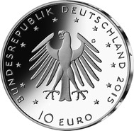
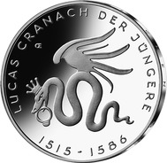
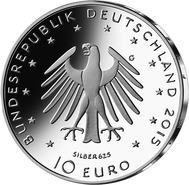

# Bekanntmachung über die Ausprägung von deutschen Euro-Gedenkmünzen im Nennwert von 10 Euro (Gedenkmünze „500. Geburtstag Lucas Cranach der Jüngere“) (Münz10EuroBek 2016-04-04)

Ausfertigungsdatum
:   2016-04-04

Fundstelle
:   BGBl I: 2016, 747

## (XXXX)

Gemäß den §§ 2, 4 und 5 des Münzgesetzes vom 16. Dezember 1999 (BGBl.
I S. 2402) hat die Bundesregierung beschlossen, anlässlich des 500.
Geburtstages von Lucas Cranach dem Jüngeren eine deutsche Euro-
Gedenkmünze im Nennwert von 10 Euro prägen zu lassen.

Die Auflage der Münze beträgt 1 207 000 Stück, davon 175 000 Stück in
Spiegelglanzqualität. Die Prägung erfolgt durch die Staatlichen Münzen
Baden-Württemberg, Prägestätte Karlsruhe (Prägezeichen G).

Die Münze wird ab dem 1. Oktober 2015 in den Verkehr gebracht. Die
10-Euro-Gedenkmünze in der Stempelglanzqualität besteht aus einer
Kupfer-Nickel-Legierung (CuNi25), hat einen Durchmesser von 32,5
Millimetern und eine Masse von 14 Gramm. Die Spiegelglanzmünze besteht
aus einer Legierung von 625 Tausendteilen Silber und 375 Tausendteilen
Kupfer, hat einen Durchmesser von 32,5 Millimetern und ein Gewicht von
16 Gramm. Das Gepräge auf beiden Seiten ist erhaben und wird von einem
schützenden, glatten Randstab umgeben.

Die Bildseite zeigt das viel verwendete Markenzeichen der Cranach-
Werkstatt, die geflügelte Cranach-Schlange.

Die Wertseite zeigt einen Adler, den Schriftzug „BUNDESREPUBLIK
DEUTSCHLAND“, Wertziffer und Wertbezeichnung, das Prägezeichen „G“ der
Staatlichen Münzen Baden-Württemberg, Prägestätte Karlsruhe, die
Jahreszahl 2015 sowie die zwölf Europasterne. Auf der Wertseite der
Münze in Spiegelglanzqualität ist zusätzlich die Angabe „SILBER 625“
aufgeprägt.

Der glatte Münzrand enthält in vertiefter Prägung die Inschrift:

„DEM FUERTREFFLICHEN MALER“.

Der Entwurf stammt von dem Künstler Erich Ott aus München.

## Schlussformel

Der Bundesminister der Finanzen

## (XXXX)

(Fundstelle: BGBl. I 2016, 747)

*    *        
    *        

*    *        
    *        

