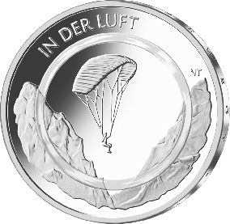
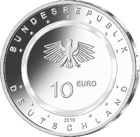

# Bekanntmachung über die Ausprägung von deutschen Euro-Gedenkmünzen im Nennwert von 10 Euro (Gedenkmünze „In der Luft“) (Münz10EuroBek 2019-08-07)

Ausfertigungsdatum
:   2019-08-07

Fundstelle
:   BGBl I: 2019, 1380

## (XXXX)

Gemäß den §§ 2, 4 und 5 des Münzgesetzes vom 16. Dezember 1999 (BGBl.
I S. 2402) hat die Bundesregierung beschlossen, eine 10-Euro-
Sammlermünze „In der Luft“ mit einem farblosen Kunststoffring prägen
zu lassen. Die Münze bildet den Auftakt einer dreiteiligen Serie „Luft
bewegt“, in der von 2019 bis 2021 jeweils eine Ausgabe pro Jahr
erscheint.

Die Auflage der Münze beträgt 1 750 000 Stück, davon 250 000 Stück in
Spiegelglanzqualität. Die Münze wird zu gleichen Teilen in den
Münzstätten Berlin, München, Stuttgart, Karlsruhe und Hamburg geprägt.
Sie besteht aus drei Komponenten: Einem äußeren Ring und einem inneren
Kern (Pille) aus Metall (CuNi25/CuNi19) sowie einem prägbaren,
zwischen Ring und Pille eingefügten, Polymerring. Die Münze hat einen
Durchmesser von 28,75 Millimetern und eine Masse von 9,8 Gramm. Das
Gepräge auf beiden Seiten ist erhaben und wird von einem schützenden,
glatten Randstab umgeben.

Die Münze wird ab dem 4. April 2019 in den Verkehr gebracht.

Die Bildseite zeigt einen Gleitschirm, der im Zentrum der Darstellung
in einer Gebirgslandschaft platziert ist.

Die Wertseite zeigt einen Adler, den Schriftzug „BUNDESREPUBLIK
DEUTSCHLAND“, Wertziffer und Wertbezeichnung, die Jahreszahl 2019, die
zwölf Europasterne sowie – je nach Prägestätte – das Münzzeichen „A“
(Berlin), „D“ (München), „F“ (Stuttgart), „G“ (Karlsruhe) oder „J“
(Hamburg).

Der glatte Münzrand enthält in vertiefter Prägung die Inschrift:

„LUFT BEWEGT*             “.

Der Entwurf der Bildseite stammt von der Künstlerin Natalie Tekampe
aus Müncheberg. Die Wertseite, die für alle Münzen der Serie verwendet
wird, wurde von dem Künstler Andre Witting aus Berlin gestaltet.

## Schlussformel

Der Bundesminister der Finanzen

## (XXXX)

(Fundstelle: BGBl. I 2019, 1380)

*    *        
    *        

*    *
    *

