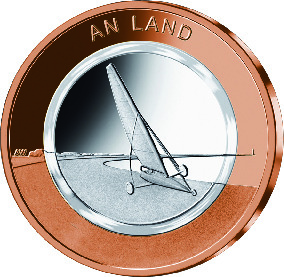
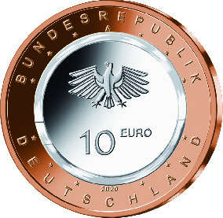

# Bekanntmachung über die Ausprägung von deutschen Euro-Gedenkmünzen im Nennwert von 10 Euro (Gedenkmünze „An Land“) (Münz10EuroBek 2020-03-20)

Ausfertigungsdatum
:   2020-03-20

Fundstelle
:   BGBl I: 2020, 763

## (XXXX)

Gemäß den §§ 2, 4 und 5 des Münzgesetzes vom 16. Dezember 1999 (BGBl.
I S. 2402) hat die Bundesregierung beschlossen, eine 10-Euro-
Sammlermünze „An Land“ mit einem farblosen Kunststoffring prägen zu
lassen. Die Münze ist die zweite Ausgabe einer dreiteiligen Serie
„Luft bewegt“, in der von 2019 bis 2021 jeweils eine Ausgabe pro Jahr
erscheint.

Die Auflage der Münze beträgt 1 750 000 Stück, davon 250 000 Stück in
Spiegelglanzqualität. Die Münze wird zu gleichen Teilen in den
Münzstätten Berlin, München, Stuttgart, Karlsruhe und Hamburg geprägt.
Sie besteht aus drei Komponenten: Einem äußeren Ring aus Rotbronze,
einem inneren Kern (Pille) aus Metall (CuNi19) sowie einem prägbaren,
zwischen Ring und Pille eingefügten, Polymerring. Die Münze hat einen
Durchmesser von 28,75 Millimetern und eine Masse von 9,8 Gramm. Das
Gepräge auf beiden Seiten ist erhaben und wird von einem schützenden,
glatten Randstab umgeben.

Die Münze wird ab dem 26. März 2020 in den Verkehr gebracht.

Die Bildseite zeigt auf sehr elegante und reduzierte Weise einen
Segelwagen, die sogenannte Yacht, in der Weite der Landschaft. Der
Entwurf konzentriert sich auf die wesentlichen Merkmale, die diesen
Sport ausmachen.

Die Wertseite zeigt einen Adler, den Schriftzug „BUNDESREPUBLIK
DEUTSCHLAND“, Wertziffer und Wertbezeichnung, die Jahreszahl 2020, die
zwölf Europasterne sowie – je nach Prägestätte – das Münzzeichen „A“
(Berlin), „D“ (München), „F“ (Stuttgart), „G“ (Karlsruhe) oder „J“
(Hamburg).

Der Entwurf der Münze stammt von dem Künstler Andre Witting aus
Berlin.

## Schlussformel

Der Bundesminister der Finanzen

## (XXXX)

(Fundstelle: BGBl. I 2020, 763)

*    *        
    *        

