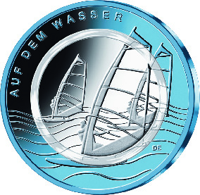
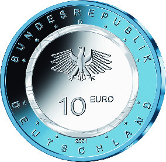

# Bekanntmachung über die Ausprägung von deutschen Euro-Gedenkmünzen im Nennwert von 10 Euro (Gedenkmünze „Auf dem Wasser“) (Münz10EuroBek 2021-04-23)

Ausfertigungsdatum
:   2021-04-23

Fundstelle
:   BGBl I: 2021, 982

## (XXXX)

Gemäß den §§ 2, 4 und 5 des Münzgesetzes vom 16. Dezember 1999 (BGBl.
I S. 2402) hat die Bundesregierung beschlossen, eine 10-Euro-
Sammlermünze „Auf dem Wasser“ mit einem farblosen Kunststoffring
prägen zu lassen. Diese Münze ist die dritte und zugleich letzte
Ausgabe der im Jahr 2019 begonnenen Serie „Luft bewegt“ (2019-2021,
eine Ausgabe pro Jahr).

Die Auflage der Münze beträgt 1 750 000 Stück, davon 250 000 Stück in
Spiegelglanzqualität. Die Münze wird zu gleichen Teilen in den
Münzstätten Berlin, München, Stuttgart, Karlsruhe und Hamburg geprägt.
Sie besteht aus drei Komponenten: Einem äußeren blauen, Niob
beschichteten Kupfer-Nickel-Ring, einem inneren Kern (Pille) aus
Metall (CuNi19) sowie einem prägbaren, zwischen Ring und Pille
eingefügten, Polymerring. Die Münze hat einen Durchmesser von 28,75
Millimetern und eine Masse von 9,8 Gramm. Das Gepräge auf beiden
Seiten ist erhaben und wird von einem schützenden, glatten Randstab
umgeben.

Die Münze wird ab dem 25. März 2021 in den Verkehr gebracht.

Die Bildseite gibt die wesentlichen Aspekte des modernen Windsurfens
wieder. Die Segel der in der Gruppe surfenden Sportler sind mit dem
Wellengang verwoben. Die grafisch gehaltene Darstellung schafft große
Transparenz und Tiefe. Das Bildmotiv wird hervorragend in die drei
verschiedenen Segmente der Münze mit Polymerring eingepasst.

Die Wertseite zeigt einen Adler, den Schriftzug „BUNDESREPUBLIK
DEUTSCHLAND“, Wertziffer und Wertbezeichnung, die Jahreszahl 2021, die
zwölf Europasterne sowie – je nach Prägestätte – das Münzzeichen „A“
(Berlin), „D“ (München), „F“ (Stuttgart), „G“ (Karlsruhe) oder „J“
(Hamburg).

Der Entwurf der Bildseite stammt von dem Künstler Daniel Engelberg aus
München. Die Wertseite, die bei allen Münzen der Serie identisch ist,
wurde von dem Künstler Andre Witting aus Berlin gestaltet.

## Schlussformel

Der Bundesminister der Finanzen

## (XXXX)

(Fundstelle: BGBl. I 2021, 982)

*    *        
    *        

