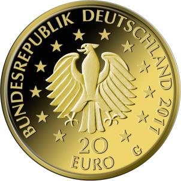

# Bekanntmachung über die Ausprägung von deutschen Euro-Gedenkmünzen im Nennwert von 20 Euro (Goldmünze „Buche“ der Serie „Deutscher Wald“) (Münz20EuroBek 2011)

Ausfertigungsdatum
:   2011-07-27

Fundstelle
:   BGBl I: 2011, 1551

## (XXXX)

Gemäß den §§ 2, 4 und 5 des Münzgesetzes vom 16. Dezember 1999 (BGBl.
I S. 2402) hat die Bundesregierung am 27. Januar 2010 beschlossen, in
den Jahren 2010 bis 2015 eine Serie von Kleinen Goldmünzen im
Nominalwert von 20 Euro prägen zu lassen, die dem deutschen Wald
gewidmet sind und die sich im Kontext mit dem Internationalen Jahr der
Wälder 2011 (UN-Resolution 61/193 vom 20. Dezember 2006) befindet. Die
Serie begann 2010 mit der Münze „Eiche“ und wurde mit Herausgabe der
Münze „Buche“ im Jahr 2011 fortgesetzt. Diese Münze wurde am 23. Juni
2011 in den Verkehr gebracht.

Die limitierte Auflage der 20-Euro-Goldmünze
„Buche“              beträgt 200 000 Stück. Die Münze wurde zu
gleichen Teilen in den Münzstätten Berlin (Münzzeichen „A“), München
(Münzzeichen „D“), Stuttgart (Münzzeichen „F“), Karlsruhe (Münzzeichen
„G“) und Hamburg (Münzzeichen „J“) in Stempelglanzausführung geprägt.

Sie besteht aus Gold mit einem Feingehalt von 999,9 Tausendteilen
(Feingold). Sie hat einen Durchmesser von 17,5 Millimeter und eine
Masse (Gewicht) von 3,89 Gramm beziehungsweise 1/8 Unze. Der Münzrand
ist geriffelt.

Der Entwurf der Bild- und der Wertseite der Münze „Buche“ stammt von
dem Künstler Frantisek Chochola aus Hamburg.

Die Wertseite zeigt einen Adler, den Schriftzug „BUNDESREPUBLIK
DEUTSCHLAND“, die zwölf Europasterne, die Wertziffer mit der Euro-
Bezeichnung sowie die Jahreszahl „2011“ und – je nach Münzstätte – das
Münzzeichen „A“, „D“, „F“, „G“ oder „J“.

## Schlussformel

Der Bundesminister der Finanzen

## (XXXX)

(Fundstelle: BGBl. I 2011, 1551)

*    *        
    *        

