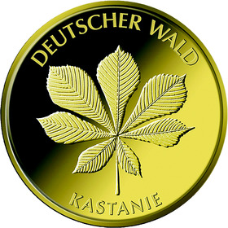
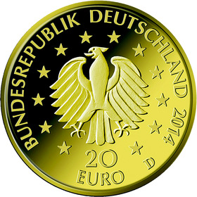

# Bekanntmachung über die Ausprägung von deutschen Euro-Gedenkmünzen im Nennwert von 20 Euro (Goldmünze „Kastanie“ der Serie „Deutscher Wald“) (Münz20EuroBek 2015-06-23)

Ausfertigungsdatum
:   2015-06-23

Fundstelle
:   BGBl I: 2015, 1108

## (XXXX)

Gemäß den §§ 2, 4 und 5 des Münzgesetzes vom 16. Dezember 1999 (BGBl.
I S. 2402) hat die Bundesregierung am 27. Januar 2010 beschlossen, in
den Jahren 2010 bis 2015 eine Serie von Kleinen Goldmünzen im
Nominalwert von 20 Euro prägen zu lassen, die dem deutschen Wald
gewidmet sind und die sich im Kontext mit dem Internationalen Jahr der
Wälder 2011 (UN-
Resolution 61/193              vom 20. Dezember 2006) befindet.
Bislang sind im Rahmen der Serie die Münzen „Eiche“ (2010), „Buche“
(2011), „Fichte“ (2012) und „Kiefer“ (2013) erschienen. Im Jahr 2014
wird die Ausgabe mit der Münze „Kastanie“ fortgesetzt. Die Münze wird
ab dem 26. Juni 2014 in den Verkehr gebracht.

Die limitierte Auflage der 20-Euro-Goldmünze „Kastanie“ beträgt
200 000 Stück. Die Münze wird zu gleichen Teilen in den Münzstätten
Berlin (Münzzeichen „A“), München (Münzzeichen „D“), Stuttgart
(Münzzeichen „F“), Karlsruhe (Münzzeichen „G“) und Hamburg
(Münzzeichen „J“) in Stempelglanzausführung geprägt.

Sie besteht aus Gold mit einem Feingehalt von 999,9 Tausendteilen
(Feingold), hat einen Durchmesser von 17,5 Millimeter und eine Masse
(Gewicht) von 3,89 Gramm beziehungsweise 1/8 Unze. Der Münzrand ist
geriffelt.

Der Entwurf der Bildseite stammt von dem Künstler Heinz Hoyer aus
Berlin. Die Wertseite wurde von dem Künstler Frantisek Chochola aus
Hamburg entworfen.

Die Wertseite zeigt einen Adler, den Schriftzug „BUNDESREPUBLIK
DEUTSCHLAND“, die zwölf Europasterne, die Wertziffer mit der Euro-
Bezeichnung sowie die Jahreszahl „2014“ und – je nach Münzstätte – das
Münzzeichen „A“, „D“, „F“, „G“ oder „J“.

## Schlussformel

Der Bundesminister der Finanzen

## (XXXX)

(Fundstelle: BGBl. I 2015, 1108)

*    *        
    *        

