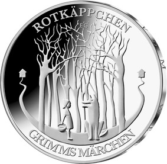
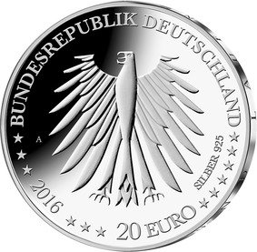

# Bekanntmachung über die Ausprägung von deutschen Euro-Gedenkmünzen im Nennwert von 20 Euro (Gedenkmünze „Rotkäppchen“) (Münz20EuroBek 2016-04-04/1)

Ausfertigungsdatum
:   2016-04-04

Fundstelle
:   BGBl I: 2016, 751

## (XXXX)

Gemäß den §§ 2, 4 und 5 des Münzgesetzes vom 16. Dezember 1999 (BGBl.
I S. 2402) hat die Bundesregierung beschlossen, zum Thema
„Rotkäppchen“ eine deutsche Euro-Gedenkmünze im Nennwert von 20 Euro
prägen zu lassen. Diese Münze ist die fünfte Ausgabe im Rahmen der
2012 begonnenen Serie „200 Jahre Grimms Märchen“. Am 20. Dezember 1812
erschien der erste Band der Kinder- und Hausmärchen der Gebrüder
Grimm.

Die Auflage der Münze beträgt ca. 1,3 Millionen Stück, davon ca. 0,2
Millionen Stück in Spiegelglanzqualität. Die Prägung erfolgt durch die
Staatliche Münze Berlin (Prägezeichen A).

Die Münze wird ab dem 4. Februar 2016 in den Verkehr gebracht. Sie
besteht aus einer Legierung von 925 Tausendteilen Silber und 75
Tausendteilen Kupfer, hat einen Durchmesser von 32,5 Millimetern und
eine Masse von 18 Gramm. Das Gepräge auf beiden Seiten ist erhaben und
wird von einem schützenden, glatten Randstab umgeben.

Die Bildseite zeigt eine der typischsten Szenen des Märchens: Auf dem
Weg zur Großmutter trifft Rotkäppchen auf den Wolf. Der Entwurf
überzeugt durch seine gelungene Konzentration auf diese erste
Begegnung. Der dunkle Wald mit seinen vertikal ineinander
verflochtenen Strukturen symbolisiert das Unbekannte und Unbewusste
der Märchenhandlung.

Die Wertseite zeigt einen Adler, den Schriftzug „BUNDESREPUBLIK
DEUTSCHLAND“, Wertziffer und Wertbezeichnung, das Prägezeichen „A“ der
Staatlichen Münze Berlin, die Jahreszahl 2016, die zwölf Europasterne
sowie die Angabe „SILBER 925“.

Der glatte Münzrand enthält in vertiefter Prägung die Inschrift:

„…UND LAUF NICHT VOM WEG AB“.

Der Entwurf stammt von der Künstlerin Elena Gerber aus Berlin.

## Schlussformel

Der Bundesminister der Finanzen

## (XXXX)

(Fundstelle: BGBl. I 2016, 751)

*    *        
    *        

