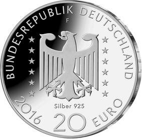

# Bekanntmachung über die Ausprägung von deutschen Euro-Gedenkmünzen im Nennwert von 20 Euro (Gedenkmünze „125. Geburtstag Nelly Sachs“) (Münz20EuroBek 2016-04-04/2)

Ausfertigungsdatum
:   2016-04-04

Fundstelle
:   BGBl I: 2016, 753

## (XXXX)

Gemäß den §§ 2, 4 und 5 des Münzgesetzes vom 16. Dezember 1999 (BGBl.
I S. 2402) hat die Bundesregierung beschlossen, zur Würdigung der
Literaturnobelpreisträgerin Nelly Sachs eine deutsche Euro-Gedenkmünze
„125. Geburtstag Nelly Sachs“ im Nennwert von 20 Euro prägen zu
lassen.

Die Auflage der Münze beträgt ca. 1,3 Millionen Stück, davon ca. 0,2
Millionen Stück in Spiegelglanzqualität. Die Prägung erfolgt durch die
Staatlichen Münzen Baden-Württemberg, Prägestätte Stuttgart.

Die Münze wird ab dem 7. April 2016 in den Verkehr gebracht. Sie
besteht aus einer Legierung von 925 Tausendteilen Silber und 75
Tausendteilen Kupfer, hat einen Durchmesser von 32,5 Millimetern und
eine Masse von 18 Gramm. Das Gepräge auf beiden Seiten ist erhaben und
wird von einem schützenden, glatten Randstab umgeben.

Die Bildseite stellt eines der zentralen Themen aus dem Schaffen der
deutsch-jüdischen Dichterin und Nobelpreisträgerin Nelly Sachs in den
Mittelpunkt: Das Gedicht „Kommt einer von Ferne“, auf das die Münze
Bezug nimmt, setzt sich mit der Aufarbeitung der Shoa, mit Flucht und
Verfolgung auseinander und beweist damit zugleich eine hohe
Aktualität.

Die Wertseite zeigt einen Adler, den Schriftzug „BUNDESREPUBLIK
DEUTSCHLAND“, Wertziffer und Wertbezeichnung, das Prägezeichen „F“ der
Staatlichen Münzen Baden-Württemberg, Prägestätte Stuttgart, die
Jahreszahl 2016, die zwölf Europasterne sowie die Angabe „SILBER 925“.

Der glatte Münzrand enthält in vertiefter Prägung die Inschrift:

„FRIEDEN DU LEISESTE ALLER GEBURTEN“.

Der Entwurf stammt von dem Künstler Georg Mann aus Halle an der Saale.

## Schlussformel

Der Bundesminister der Finanzen

## (XXXX)

(Fundstelle: BGBl. I 2016, 753)

*    *        
    *        

