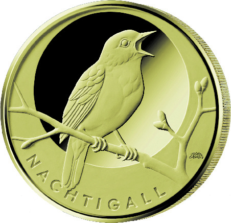
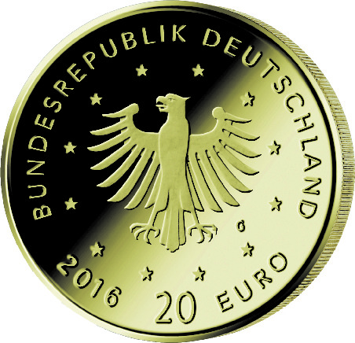

# Bekanntmachung über die Ausprägung von deutschen Euro-Gedenkmünzen im Nennwert von 20 Euro (Goldmünze „Nachtigall“ der Serie „Heimische Vögel“) (Münz20EuroBek 2016-07-11)

Ausfertigungsdatum
:   2016-06-16

Fundstelle
:   BGBl I: 2016, 1583

## (XXXX)

Gemäß den §§ 2, 4 und 5 des Münzgesetzes vom 16. Dezember 1999 (BGBl.
I S. 2402) hat die Bundesregierung beschlossen, in den Jahren 2016 bis
2021 eine Serie von Goldmünzen im Nennwert von 20 Euro zum Thema
„Heimische Vögel“ prägen zu lassen. Die Serie beginnt mit der Münze
„Nachtigall“, die ab dem 23. Juni 2016 in den Verkehr gebracht wird.

Die limitierte Auflage der 20-Euro-Goldmünze „Nachtigall“ beträgt
maximal 200 000 Stück. Die Münze wird zu gleichen Teilen in den
Münzstätten Berlin (Münzzeichen „A“), München (Münzzeichen „D“),
Stuttgart (Münzzeichen „F“), Karlsruhe (Münzzeichen „G“) und Hamburg
(Münzzeichen „J“) in Stempelglanzausführung geprägt.

Sie besteht aus Gold mit einem Feingehalt von
999,9 Tausendteilen              (Feingold), hat einen Durchmesser von
17,5 Millimetern und eine Masse von 3,89 Gramm. Der Münzrand ist
geriffelt.

Der Entwurf der Bildseite stammt von dem Künstler Bodo Broschat aus
Berlin. Die Wertseite wurde von der Künstlerin Adelheid Fuss aus
Schwielowsee/Geltow entworfen.

Auf der Bildseite wird eine Nachtigall dargestellt.

Die Wertseite zeigt einen Adler, den Schriftzug „BUNDESREPUBLIK
DEUTSCHLAND“, die zwölf Europasterne, die Wertziffer mit der Euro-
Bezeichnung sowie die Jahreszahl „2016“ und – je nach Münzstätte – das
Münzzeichen „A“, „D“, „F“, „G“ oder „J“.

## Schlussformel

Der Bundesminister der Finanzen

## (XXXX)

(Fundstelle: BGBl. I 2016, 1583)

*    *        
    *        

