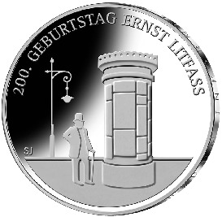

# Bekanntmachung über die Ausprägung von deutschen Euro-Gedenkmünzen im Nennwert von 20 Euro (Gedenkmünze „200. Geburtstag Ernst Litfaß“) (Münz20EuroBek 2016-12-01)

Ausfertigungsdatum
:   2016-12-01

Fundstelle
:   BGBl I: 2016, 2855

## (XXXX)

Gemäß den §§ 2, 4 und 5 des Münzgesetzes vom 16. Dezember 1999 (BGBl.
I S. 2402) hat die Bundesregierung beschlossen, eine deutsche Euro-
Gedenkmünze „200. Geburtstag Ernst Litfaß“ im Nennwert von 20 Euro
prägen zu lassen.

Die Auflage der Münze beträgt ca. 1,2 Millionen Stück, davon ca. 0,2
Millionen Stück in Spiegelglanzqualität. Die Prägung erfolgt durch das
Bayerische Hauptmünzamt, München.

Die Münze wird ab dem 7. Juli 2016 in den Verkehr gebracht. Sie
besteht aus einer Legierung von 925 Tausendteilen Silber und 75
Tausendteilen Kupfer, hat einen Durchmesser von 32,5 Millimetern und
eine Masse von 18 Gramm. Das Gepräge auf beiden Seiten ist erhaben und
wird von einem schützenden, glatten Randstab umgeben.

Die Bildseite zeigt im Mittelpunkt eine stilisierte männliche Person,
die sowohl an überlieferte Bilder von Ernst Litfaß erinnert, aber auch
für den Bürger stehen kann, der die nach Litfaß benannte Säule als
Informationsquelle nutzt.

Die Wertseite zeigt einen Adler, den Schriftzug „BUNDESREPUBLIK
DEUTSCHLAND“, Wertziffer und Wertbezeichnung, das Prägezeichen „D“ des
Bayerischen Hauptmünzamtes, München, die Jahreszahl 2016, die zwölf
Europasterne sowie die Angabe
„SILBER 925“             .

Der glatte Münzrand enthält in vertiefter Prägung die Inschrift:

„RUNDUM INFORMIERT RUNDUM
INFORMIERT*             “.

Der Entwurf stammt von der Künstlerin Susanne Jünger aus Berlin.

## Schlussformel

Der Bundesminister der Finanzen

## (XXXX)

(Fundstelle: BGBl. I 2016, 2855)

*    *        
    *        

