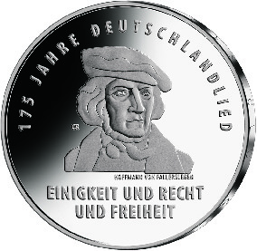
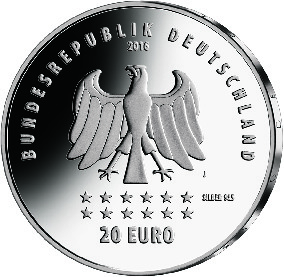

# Bekanntmachung über die Ausprägung von deutschen Euro-Gedenkmünzen im Nennwert von 20 Euro (Gedenkmünze „175 Jahre Deutschlandlied“) (Münz20EuroBek 2016-12-01/2)

Ausfertigungsdatum
:   2016-12-01

Fundstelle
:   BGBl I: 2016, 2867

## (XXXX)

Gemäß den §§ 2, 4 und 5 des Münzgesetzes vom 16. Dezember 1999 (BGBl.
I S. 2402) hat die Bundesregierung beschlossen, eine deutsche Euro-
Gedenkmünze „175 Jahre Deutschlandlied“ im Nennwert von 20 Euro prägen
zu lassen.

Die Auflage der Münze beträgt ca. 1,3 Millionen Stück, davon ca. 0,2
Millionen Stück in Spiegelglanzqualität. Die Prägung erfolgt durch die
Hamburgische Münze.

Die Münze wird ab dem 6. Oktober 2016 in den Verkehr gebracht. Sie
besteht aus einer Legierung von 925 Tausendteilen Silber und 75
Tausendteilen Kupfer, hat einen Durchmesser von 32,5 Millimetern und
eine Masse von 18 Gramm. Das Gepräge auf beiden Seiten ist erhaben und
wird von einem schützenden, glatten Randstab umgeben.

Die Bildseite zeigt eine ausdrucksstarke Abbildung des Liedautors
Hoffmann von Fallersleben und den Textauszug aus dem Deutschlandlied
„Einigkeit und Recht und Freiheit“.

Die Wertseite zeigt einen Adler, den Schriftzug „BUNDESREPUBLIK
DEUTSCHLAND“, Wertziffer und Wertbezeichnung, das Prägezeichen „J“ der
Hamburgischen Münze, die Jahreszahl 2016, die zwölf Europasterne sowie
die Angabe „SILBER 925“.

Der glatte Münzrand enthält in vertiefter Prägung die Inschrift:

„SIND DES GLUECKES UNTERPFAND …“.

Der Entwurf stammt von dem Künstler Claudius Riedmiller aus Stuttgart.

## Schlussformel

Der Bundesminister der Finanzen

## (XXXX)

(Fundstelle: BGBl. I 2016, 2867)

*    *        
    *        

