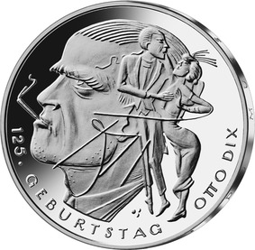
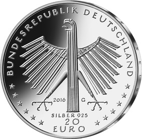

# Bekanntmachung über die Ausprägung von deutschen Euro-Gedenkmünzen im Nennwert von 20 Euro (Gedenkmünze „125. Geburtstag Otto Dix“) (Münz20EuroBek 2016-12-01/3)

Ausfertigungsdatum
:   2016-12-01

Fundstelle
:   BGBl I: 2016, 2868

## (XXXX)

Gemäß den §§ 2, 4 und 5 des Münzgesetzes vom 16. Dezember 1999 (BGBl.
I S. 2402) hat die Bundesregierung beschlossen, eine deutsche Euro-
Gedenkmünze „125. Geburtstag Otto Dix“ im Nennwert von 20 Euro prägen
zu lassen.

Die Auflage der Münze beträgt ca. 1,2 Millionen Stück, davon ca. 0,2
Millionen Stück in Spiegelglanzqualität. Die Prägung erfolgt durch die
Staatlichen Münzen Baden-Württemberg, Prägestätte Karlsruhe.

Die Münze wird ab dem 3. November 2016 in den Verkehr gebracht. Sie
besteht aus einer Legierung von 925 Tausendteilen Silber und 75
Tausendteilen Kupfer, hat einen Durchmesser von 32,5 Millimetern und
eine Masse von 18 Gramm. Das Gepräge auf beiden Seiten ist erhaben und
wird von einem schützenden, glatten Randstab umgeben.

Die Bildseite würdigt Werk und Schaffen von Otto Dix. Sie zeigt ein
Relief, das in virtuoser Collage Portrait, ein bildnerisches Zitat
eines Hauptmotivs seines Schaffens und seine Signatur verbindet.

Die Wertseite zeigt einen Adler, den Schriftzug „BUNDESREPUBLIK
DEUTSCHLAND“, Wertziffer und Wertbezeichnung, das Prägezeichen „G“ der
Staatlichen Münzen Baden-Württemberg, Prägestätte Karlsruhe, die
Jahreszahl 2016, die zwölf Europasterne sowie die Angabe „SILBER 925“.

Der glatte Münzrand enthält in vertiefter Prägung die Inschrift:

„DU MUSST ALLES SELBER SEIN ! “.

Der Entwurf stammt von dem Künstler Friedrich Brenner aus Diedorf.

## Schlussformel

Der Bundesminister der Finanzen

## (XXXX)

(Fundstelle: BGBl. I 2016, 2868)

*    *        
    *        

