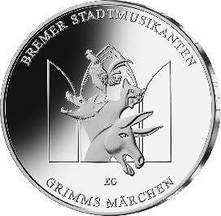
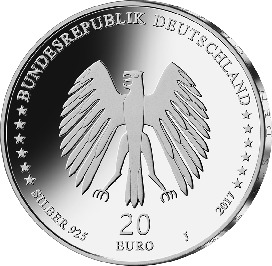

# Bekanntmachung über die Ausprägung von deutschen Euro-Gedenkmünzen im Nennwert von 20 Euro (Gedenkmünze „Bremer Stadtmusikanten“ Stadtmusikanten) (Münz20EuroBek 2017-01-13)

Ausfertigungsdatum
:   2017-01-13

Fundstelle
:   BGBl I: 2017, 107

## (XXXX)

Gemäß den §§ 2, 4 und 5 des Münzgesetzes vom 16. Dezember 1999 (BGBl.
I S. 2402) hat die Bundesregierung beschlossen, zum Thema „Bremer
Stadtmusikanten“ eine deutsche Euro-Gedenkmünze im Nennwert von 20
Euro prägen zu lassen. Diese Münze ist die sechste Ausgabe im Rahmen
der 2012 begonnenen Serie „200 Jahre Grimms Märchen“. Am 20. Dezember
1812 erschien der erste Band der Kinder- und Hausmärchen der Gebrüder
Grimm.

Die Auflage der Münze beträgt ca. 1,2 Millionen Stück, davon ca. 0,2
Millionen Stück in Spiegelglanzqualität. Die Prägung erfolgt durch die
Hamburgische Münze (Prägezeichen J).

Die Münze wird ab dem 9. Februar 2017 in den Verkehr gebracht. Sie
besteht aus einer Legierung von 925 Tausendteilen Silber und 75
Tausendteilen Kupfer, hat einen Durchmesser von 32,5 Millimetern und
eine Masse von 18 Gramm. Das Gepräge auf beiden Seiten ist erhaben und
wird von einem schützenden, glatten Randstab umgeben.

Die Bildseite zeigt den Kulminationspunkt der Märchenhandlung. Die
plastisch und lebendig dargestellten Tiergestalten drängen sich durch
das zart angedeutete gotische Fenster in den szenischen Raum hinein.

Die Wertseite zeigt einen Adler, den Schriftzug „BUNDESREPUBLIK
DEUTSCHLAND“, Wertziffer und Wertbezeichnung, das Prägezeichen „J“ der
Hamburgischen Münze, die Jahreszahl 2017, die zwölf Europasterne sowie
die Angabe „SILBER 925“.

Der glatte Münzrand enthält in vertiefter Prägung die Inschrift:

*    *   „ETWAS BESSERES ALS DEN TOD
        FINDEST DU ÜBERALL“.

Der Entwurf stammt von der Künstlerin Elena Gerber aus Berlin.

## Schlussformel

Der Bundesminister der Finanzen

## (XXXX)

(Fundstelle: BGBl. I 2017, 107)

*    *        
    *        

