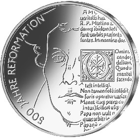
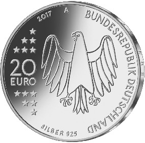

# Bekanntmachung über die Ausprägung von deutschen Euro-Gedenkmünzen im Nennwert von 20 Euro (Gedenkmünze „500 Jahre Reformation“) (Münz20EuroBek 2017-03-23)

Ausfertigungsdatum
:   2017-03-23

Fundstelle
:   BGBl I: 2017, 676

## (XXXX)

Gemäß den §§ 2, 4 und 5 des Münzgesetzes vom 16. Dezember 1999 (BGBl.
I S. 2402) hat die Bundesregierung beschlossen, zur Würdigung des
Reformationsjubiläums eine 20-Euro-Gedenkmünze „500 Jahre Reformation“
prägen zu lassen. Der Thesenanschlag Martin Luthers im Jahr 1517
bildete den Auftakt zur Reformation, einem Ereignis, das in seinen
Auswirkungen auf Politik, Religion, Kultur und Gesellschaft bis heute
von weltgeschichtlicher Bedeutung ist.

Die Auflage der Münze beträgt ca. 1,2 Millionen Stück, davon ca. 0,2
Millionen Stück in Spiegelglanzqualität. Die Prägung erfolgt durch die
Staatliche Münze Berlin (Prägezeichen A).

Die Münze wird ab dem 6. April 2017 in den Verkehr gebracht. Sie
besteht aus einer Legierung von 925 Tausendteilen Silber und 75
Tausendteilen Kupfer, hat einen Durchmesser von 32,5 Millimetern und
eine Masse von 18 Gramm. Das Gepräge auf beiden Seiten ist erhaben und
wird von einem schützenden, glatten Randstab umgeben.

Die Bildseite zeigt das Antlitz Luthers, das aus dem Gemälde Lucas
Cranachs d. Ä. von 1529 übernommen ist, zugleich aber in einer
zeitgenössischen Interpretation erscheint. Das Porträt des Reformators
und der fragmentarische Text treten gleichwertig in Erscheinung. Die
lineare Darstellung des Luther-Antlitzes unterstreicht in ihrer
Modernität die Relevanz des Ereignisses für unsere Gegenwart; die als
Textur erscheinenden Fragmente aus den 95 Thesen betonen die epochale
Bedeutung der Reformation.

Die Wertseite zeigt einen Adler, den Schriftzug „BUNDESREPUBLIK
DEUTSCHLAND“, Wertziffer und Wertbezeichnung, das Prägezeichen „A“ der
Staatlichen Münze Berlin, die Jahreszahl 2017 sowie die zwölf
Europasterne. Zusätzlich ist die Angabe „SILBER 925“ aufgeprägt.

Der glatte Münzrand enthält in vertiefter Prägung die Inschrift:

„HIER STEHE ICH, ICH KANN NICHT ANDERS“.

Der Entwurf stammt von dem Künstler Patrick Niesel aus Schwaig.

## Schlussformel

Der Bundesminister der Finanzen

## (XXXX)

(Fundstelle: BGBl. I 2017, 676)

*    *        
    *        

*    *
    *

