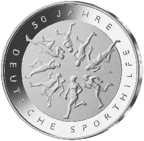

# Bekanntmachung über die Ausprägung von deutschen Euro-Gedenkmünzen im Nennwert von 20 Euro (Gedenkmünze „50 Jahre Deutsche Sporthilfe“) (Münz20EuroBek 2017-04-19)

Ausfertigungsdatum
:   2017-04-19

Fundstelle
:   BGBl I: 2017, 992

## (XXXX)

Gemäß den §§ 2, 4 und 5 des Münzgesetzes vom 16. Dezember 1999 (BGBl.
I S. 2402) hat die Bundesregierung beschlossen, zur Würdigung des
50-jährigen Bestehens der Stiftung Deutsche Sporthilfe eine 20-Euro-
Gedenkmünze „50 Jahre Deutsche Sporthilfe“ prägen zu lassen.

Die Auflage der Münze beträgt ca. 1,2 Millionen Stück, davon ca. 0,2
Millionen Stück in Spiegelglanzqualität. Die Prägung erfolgt durch das
Bayerische Hauptmünzamt, München (Prägezeichen D).

Die Münze wird ab dem 4. Mai 2017 in den Verkehr gebracht. Sie besteht
aus einer Legierung von 925 Tausendteilen Silber und 75 Tausendteilen
Kupfer, hat einen Durchmesser von 32,5 Millimetern und eine Masse von
18 Gramm. Das Gepräge auf beiden Seiten ist erhaben und wird von einem
schützenden, glatten Randstab umgeben.

Die Bildseite greift das Laufen als die klassische Sportart auf. Die
Lebendigkeit und Dynamik des Sports zeigt sich in dem rosettenhaften
Aufbau der Läuferdarstellung.

Die Wertseite zeigt einen Adler, den Schriftzug „BUNDESREPUBLIK
DEUTSCHLAND“, Wertziffer und Wertbezeichnung, das Prägezeichen „D“ des
Bayerischen Hauptmünzamtes, München, die Jahreszahl 2017 sowie die
zwölf Europasterne. Zusätzlich ist die Angabe „SILBER 925“ aufgeprägt.

Der glatte Münzrand enthält in vertiefter Prägung die Inschrift:

„LEISTUNG. FAIRPLAY. MITEINANDER.“.

Der Entwurf stammt von der Künstlerin Adelheid Fuss aus Geltow.

## Schlussformel

Der Bundesminister der Finanzen

## (XXXX)

(Fundstelle: BGBl. I 2017, 992)

*    *        
    *        

