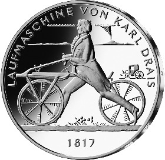
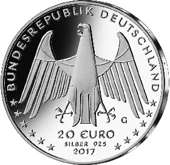

# Bekanntmachung über die Ausprägung von deutschen Euro-Gedenkmünzen im Nennwert von 20 Euro (Gedenkmünze „Laufmaschine von Karl Drais 1817“) (Münz20EuroBek 2017-06-15)

Ausfertigungsdatum
:   2017-06-15

Fundstelle
:   BGBl I: 2017, 1878

## (XXXX)

Gemäß den §§ 2, 4 und 5 des Münzgesetzes vom 16. Dezember 1999 (BGBl.
I S. 2402) hat die Bundesregierung beschlossen, eine 20-Euro-
Gedenkmünze „Laufmaschine von Karl Drais 1817“ prägen zu lassen. Mit
der Laufmaschine (oder Draisine) wurde zum ersten Mal das
Zweiradprinzip, die Bewegung eines Fahrzeugs mit zwei Rädern auf einer
Spur, verwirklicht.

Die Auflage der Münze beträgt ca. 1,2 Millionen Stück, davon ca. 0,2
Millionen Stück in Spiegelglanzqualität. Die Prägung erfolgt durch die
Staatlichen Münzen Baden-Württemberg, Prägestätte Karlsruhe
(Prägezeichen G).

Die Münze wird ab dem 13. Juli 2017 in den Verkehr gebracht. Sie
besteht aus einer Legierung von 925 Tausendteilen Silber und 75
Tausendteilen Kupfer, hat einen Durchmesser von 32,5 Millimetern und
eine Masse von 18 Gramm. Das Gepräge auf beiden Seiten ist erhaben und
wird von einem schützenden, glatten Randstab umgeben.

Die Bildseite zeigt die Laufmaschine von Karl Drais in ihrer Anwendung
durch einen Draisinenreiter.

Die Wertseite zeigt einen Adler, den Schriftzug „BUNDESREPUBLIK
DEUTSCHLAND“, Wertziffer und Wertbezeichnung, das Prägezeichen „G“ der
Staatlichen Münzen Baden-Württemberg, Prägestätte Karlsruhe, die
Jahreszahl 2017 sowie die zwölf Europasterne. Zusätzlich ist die
Angabe „SILBER 925“ aufgeprägt.

Der glatte Münzrand enthält in vertiefter Prägung die Inschrift:

*    *   „200 JAHRE ZWEIRADPRINZIP“.

Der Entwurf der Münze stammt von dem Künstler Friedrich Brenner aus
Diedorf.

## Schlussformel

Der Bundesminister der Finanzen

## (XXXX)

(Fundstelle: BGBl. I 2017, 1878)

*    *        
    *        

