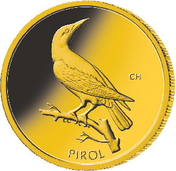
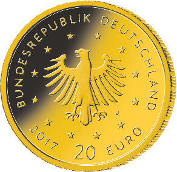

# Bekanntmachung über die Ausprägung von deutschen Euro-Gedenkmünzen im Nennwert von 20 Euro (Goldmünze „Pirol“ der Serie „Heimische Vögel“) (Münz20EuroBek 2017-10-23/1)

Ausfertigungsdatum
:   2017-10-23

Fundstelle
:   BGBl I: 2017, 3628

## (XXXX)

Gemäß den §§ 2, 4 und 5 des Münzgesetzes vom 16. Dezember 1999 (BGBl.
I S. 2402) hat die Bundesregierung beschlossen, in den Jahren 2016 bis
2021 eine Serie von Goldmünzen im Nennwert von 20 Euro zum Thema
„Heimische Vögel“ prägen zu lassen. Im Jahr 2017 wird die Ausgabe mit
der Münze „Pirol“ fortgesetzt. Die Münze wird ab dem 22. Juni 2017 in
den Verkehr gebracht.

Die limitierte Auflage der 20-Euro-Goldmünze „Pirol“ beträgt maximal
200 000 Stück. Die Münze wird zu gleichen Teilen in den Münzstätten
Berlin (Münzzeichen „A“), München (Münzzeichen „D“), Stuttgart
(Münzzeichen „F“), Karlsruhe (Münzzeichen „G“) und Hamburg
(Münzzeichen „J“) in Stempelglanzausführung geprägt.

Sie besteht aus Gold mit einem Feingehalt von 999,9 Tausendteilen
(Feingold), hat einen Durchmesser von 17,5 Millimetern und eine Masse
von 3,89 Gramm. Der Münzrand ist geriffelt.

Die Bildseite zeigt einen Pirol. Der Entwurf stammt von dem Künstler
Frantisek Chochola aus Hamburg.

Die Wertseite wurde von der Künstlerin Adelheid Fuss aus
Schwielowsee/Geltow entworfen. Sie zeigt einen Adler, den Schriftzug
„BUNDESREPUBLIK DEUTSCHLAND“, die zwölf Europasterne, die Wertziffer
mit der Euro-Bezeichnung sowie die Jahreszahl „2017“ und – je nach
Münzstätte – das Münzzeichen „A“, „D“, „F“, „G“ oder „J“.

## Schlussformel

Der Bundesminister der Finanzen

## (XXXX)

*    *        
    *        

*    *
    *

