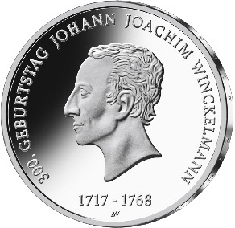
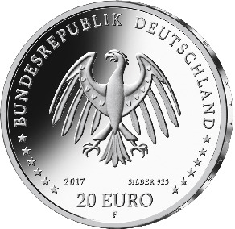

# Bekanntmachung über die Ausprägung von deutschen Euro-Gedenkmünzen im Nennwert von 20 Euro (Gedenkmünze „300. Geburtstag Johann Joachim Winckelmann“) (Münz20EuroBek 2017-10-23/2)

Ausfertigungsdatum
:   2017-10-23

Fundstelle
:   BGBl I: 2017, 3629

## (XXXX)

Gemäß den §§ 2, 4 und 5 des Münzgesetzes vom 16. Dezember 1999 (BGBl.
I S. 2402) hat die Bundesregierung beschlossen, eine 20-Euro-
Gedenkmünze „300. Geburtstag Johann Joachim Winckelmann“ prägen zu
lassen. Die Münze würdigt den Begründer der wissenschaftlichen
Archäologie und der Kunstgeschichte.

Die Auflage der Münze beträgt ca. 1,2 Millionen Stück, davon ca. 0,2
Millionen Stück in Spiegelglanzqualität. Die Prägung erfolgt durch die
Staatlichen Münzen Baden-Württemberg, Prägestätte Stuttgart
(Prägezeichen F).

Die Münze wird ab dem 12. Oktober 2017 in den Verkehr gebracht. Sie
besteht aus einer Legierung von 925 Tausendteilen Silber und 75
Tausendteilen Kupfer, hat einen Durchmesser von 32,5 Millimetern und
eine Masse von 18 Gramm. Das Gepräge auf beiden Seiten ist erhaben und
wird von einem schützenden, glatten Randstab umgeben.

Die Bildseite zeigt das Porträt von Johann Joachim Winckelmann nach
dem Vorbild vieler antiker Münzen im Profil.

Die Wertseite zeigt einen Adler, den Schriftzug „BUNDESREPUBLIK
DEUTSCHLAND“, Wertziffer und Wertbezeichnung, das Prägezeichen „F“ der
Staatlichen Münzen Baden-Württemberg, Prägestätte Stuttgart, die
Jahreszahl 2017 sowie die zwölf Europasterne. Zusätzlich ist die
Angabe „SILBER 925“ aufgeprägt.

Der glatte Münzrand enthält in vertiefter Prägung die Inschrift:

*    *   „EDLE EINFALT UND STILLE GRÖSSE“.

Der Entwurf der Münze stammt von dem Künstler Andre Witting aus
Berlin.

## Schlussformel

Der Bundesminister der Finanzen

## (XXXX)

*    *        
    *        

