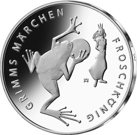
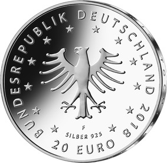

# Bekanntmachung über die Ausprägung von deutschen Euro-Gedenkmünzen im Nennwert von 20 Euro (Gedenkmünze „Froschkönig“) (Münz20EuroBek 2018-07-23/1)

Ausfertigungsdatum
:   2018-07-02

Fundstelle
:   BGBl I: 2018, 1207

## (XXXX)

Gemäß den §§ 2, 4 und 5 des Münzgesetzes vom 16. Dezember 1999 (BGBl.
I S. 2402) hat die Bundesregierung beschlossen, zum Thema
„Froschkönig“ eine deutsche Euro-Gedenkmünze im Nennwert von 20 Euro
prägen zu lassen. Diese Münze ist die siebente Ausgabe im Rahmen der
2012 begonnenen Serie „200 Jahre Grimms Märchen“. Am 20. Dezember 1812
erschien der erste Band der Kinder- und Hausmärchen der Gebrüder
Grimm.

Die Auflage der Münze beträgt ca. 1,1 Millionen Stück, davon ca. 0,1
Millionen Stück in Spiegelglanzqualität. Die Prägung erfolgt durch die
Staatlichen Münzen Baden-Württemberg, Prägestätte Stuttgart
(Prägezeichen F).

Die Münze wird ab dem 25. Januar 2018 in den Verkehr gebracht. Sie
besteht aus einer Legierung von 925 Tausendteilen Silber und 75
Tausendteilen Kupfer, hat einen Durchmesser von 32,5 Millimetern und
eine Masse von 18 Gramm. Das Gepräge auf beiden Seiten ist erhaben und
wird von einem schützenden, glatten Randstab umgeben.

Die Bildseite stellt mit den drei wesentlichen Elementen – dem
Froschkönig, der Goldkugel und der Königstochter – die
Grundkonstellation des Märchens dynamisch und in ungewöhnlicher
Perspektive dar.

Die Wertseite zeigt einen Adler, den Schriftzug „BUNDESREPUBLIK
DEUTSCHLAND“, Wertziffer und Wertbezeichnung, das Prägezeichen „F“ der
Staatlichen Münzen Baden-Württemberg, Prägestätte Stuttgart, die
Jahreszahl 2018 sowie die zwölf Europasterne. Auf der Wertseite der
Münze ist zusätzlich die Angabe „SILBER 925“ aufgeprägt.

Der glatte Münzrand enthält in vertiefter Prägung die Inschrift:

„KÖNIGSTOCHTER JÜNGSTE MACH MIR AUF !“.

Der Entwurf stammt von der Künstlerin Anne Karen Hentschel aus Bremen.

## Schlussformel

Der Bundesminister der Finanzen

## (XXXX)

(Fundstelle: BGBl. I 2018, 1207)

*    *        
    *        

