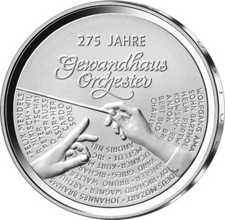
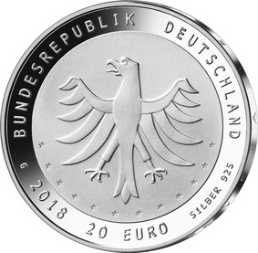

# Bekanntmachung über die Ausprägung von deutschen Euro-Gedenkmünzen im Nennwert von 20 Euro (Gedenkmünze „275 Jahre Gewandhausorchester“) (Münz20EuroBek 2018-07-23/2)

Ausfertigungsdatum
:   2018-07-02

Fundstelle
:   BGBl I: 2018, 1208

## (XXXX)

Gemäß den §§ 2, 4 und 5 des Münzgesetzes vom 16. Dezember 1999 (BGBl.
I S. 2402) hat die Bundesregierung beschlossen, zum Thema „275 Jahre
Gewandhausorchester“ eine deutsche Euro-Gedenkmünze im Nennwert von 20
Euro prägen zu lassen. Die Münze würdigt das Gewandhausorchester, das
im Jahr 2018 sein 275. Jubiläum feiert und nach wie vor zu den
renommiertesten Klangkörpern der Welt zählt.

Die Auflage der Münze beträgt ca. 1,0 Millionen Stück, davon ca. 0,1
Millionen Stück in Spiegelglanzqualität. Die Prägung erfolgt durch die
Staatlichen Münzen Baden-Württemberg, Prägestätte Karlsruhe
(Prägezeichen G).

Die Münze wird ab dem 8. März 2018 in den Verkehr gebracht. Sie
besteht aus einer Legierung von 925 Tausendteilen Silber und 75
Tausendteilen Kupfer, hat einen Durchmesser von 32,5 Millimetern und
eine Masse von 18 Gramm. Das Gepräge auf beiden Seiten ist erhaben und
wird von einem schützenden, glatten Randstab umgeben.

Die Bildseite zeigt das Tschörtnersche Logo des Gewandhausorchesters,
dem eine Auswahl von herausragenden musikalischen Persönlichkeiten
gegenübergestellt ist. Im Zentrum des Entwurfs steht der Auftakt zum
bevorstehenden Konzert. Zwei Hände dirigieren mit einem Stab, der auf
die künstlerische Vielfalt des Gewandhausorchesters weist.

Die Wertseite zeigt einen Adler, den Schriftzug „BUNDESREPUBLIK
DEUTSCHLAND“, Wertziffer und Wertbezeichnung, das Prägezeichen „G“ der
Staatlichen Münzen Baden-Württemberg, Prägestätte Karlsruhe, die
Jahreszahl 2018 sowie die zwölf Europasterne. Zusätzlich ist die
Angabe „SILBER 925“ aufgeprägt.

Der glatte Münzrand enthält in vertiefter Prägung die Inschrift:

„• RES SEVERA VERUM GAUDIUM“.

Dies ist die lateinische Originalvariante des Orchesterleitspruches
„WAHRE FREUDE IST EINE ERNSTE SACHE“.

Der Entwurf der Münze stammt von der Künstlerin Lucia Maria Hardegen
aus Bonn.

## Schlussformel

Der Bundesminister der Finanzen

## (XXXX)

(Fundstelle: BGBl. I 2018, 1208)

*    *        
    *        

