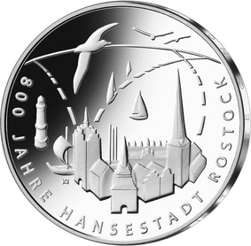
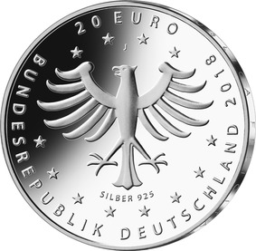

# Bekanntmachung über die Ausprägung von deutschen Euro-Gedenkmünzen im Nennwert von 20 Euro (Gedenkmünze „800 Jahre Hansestadt Rostock“) (Münz20EuroBek 2018-07-23/3)

Ausfertigungsdatum
:   2018-07-02

Fundstelle
:   BGBl I: 2018, 1209

## (XXXX)

Gemäß den §§ 2, 4 und 5 des Münzgesetzes vom 16. Dezember 1999 (BGBl.
I S. 2402) hat die Bundesregierung beschlossen, zum Thema „800 Jahre
Hansestadt Rostock“ eine deutsche Euro-Gedenkmünze im Nennwert von 20
Euro prägen zu lassen. Die Münze erinnert an die
Stadtrechtsbestätigung für Rostock im Jahre 1218.

Die Auflage der Münze beträgt ca. 1,0 Millionen Stück, davon ca. 0,1
Millionen Stück in Spiegelglanzqualität. Die Prägung erfolgt durch die
Hamburgische Münze (Prägezeichen J).

Die Münze wird ab dem 17. Mai 2018 in den Verkehr gebracht. Sie
besteht aus einer Legierung von 925 Tausendteilen Silber und 75
Tausendteilen Kupfer, hat einen Durchmesser von 32,5 Millimetern und
eine Masse von 18 Gramm. Das Gepräge auf beiden Seiten ist erhaben und
wird von einem schützenden, glatten Randstab umgeben.

Die Bildseite zeigt den Blick über die Hansestadt Rostock hinweg auf
das offene Meer, dem die Stadt ihre Geschichte und internationale
Einbindung zu verdanken hat. Die Stadt erscheint einladend mit den
Wahrzeichen Petrikirche, Kröpeliner Tor, Steintor und Rathaus. Von der
Stadt ausgehende dynamische Linien zeichnen den Horizont, den
Vogelflug und die für Rostock bedeutenden Schifffahrts- und
Handelsrouten nach.

Die Wertseite zeigt einen Adler, den Schriftzug „BUNDESREPUBLIK
DEUTSCHLAND“, Wertziffer und Wertbezeichnung, das Prägezeichen „J“ der
Hamburgischen Münze, die Jahreszahl 2018 sowie die zwölf Europasterne.
Zusätzlich ist die Angabe „SILBER 925“ aufgeprägt.

Der glatte Münzrand enthält in vertiefter Prägung die Inschrift:

„SIT INTRA TE CONCORDIA
ET PUBLICA FELICITAS*             “.

Es handelt sich hierbei um die lateinische Inschrift des Rostocker
Steintores (In deinen Mauern herrsche Eintracht und öffentliches
Wohlergehen).

Der Entwurf der Münze stammt von der Künstlerin Anne Karen Hentschel
aus Bremen.

## Schlussformel

Der Bundesminister der Finanzen

## (XXXX)

(Fundstelle: BGBl. I 2018, 1209)

*    *        
    *        

