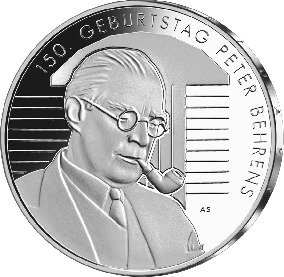
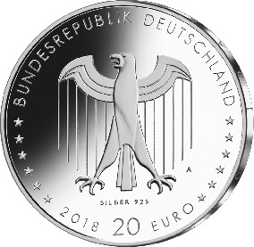

# Bekanntmachung über die Ausprägung von deutschen Euro-Gedenkmünzen im Nennwert von 20 Euro (Gedenkmünze „150. Geburtstag Peter Behrens“) (Münz20EuroBek 2018-10-02)

Ausfertigungsdatum
:   2018-10-02

Fundstelle
:   BGBl I: 2018, 1714

## (XXXX)

Gemäß den §§ 2, 4 und 5 des Münzgesetzes vom 16. Dezember 1999 (BGBl.
I S. 2402) hat die Bundesregierung beschlossen, eine deutsche Euro-
Gedenkmünze zum Thema „150. Geburtstag Peter Behrens“ im Nennwert von
20 Euro prägen zu lassen. Die Münze würdigt Peter Behrens (1868 –
1940), einen deutschen Architekten, Maler und Designer, der als
Pionier des modernen Industriedesigns gilt.

Die Auflage der Münze beträgt ca. 1,0 Millionen Stück, davon ca. 0,1
Millionen Stück in Spiegelglanzqualität. Die Prägung erfolgt durch die
Staatliche Münze Berlin (Prägezeichen A).

Die Münze wird ab dem 13. September 2018 in den Verkehr gebracht. Sie
besteht aus einer Legierung von 925 Tausendteilen Silber und 75
Tausendteilen Kupfer, hat einen Durchmesser von 32,5 Millimetern und
eine Masse von 18 Gramm. Das Gepräge auf beiden Seiten ist erhaben und
wird von einem schützenden, glatten Randstab umgeben.

Die Bildseite zeigt den Architekten Behrens vor einer Abstraktion
seines prominentesten Industriebaus, der legendären Turbinenhalle in
Berlin. Die lichte, leicht gesperrte Schrift steht formal für die
Schaffensperiode des Jubilars.

Die Wertseite zeigt einen Adler, den Schriftzug „BUNDESREPUBLIK
DEUTSCHLAND“, Wertziffer und Wertbezeichnung, das Prägezeichen „A“ der
Staatlichen Münze Berlin, die Jahreszahl 2018 sowie die zwölf
Europasterne. Zusätzlich ist die Angabe
„SILBER 925“              aufgeprägt.

Der glatte Münzrand enthält in vertiefter Prägung die Inschrift:

„IM UEBRIGEN AUTODIDAKT*             “.

Der Entwurf stammt von der Künstlerin Anna Steinmann aus Berlin.

## Schlussformel

Der Bundesminister der Finanzen

## (XXXX)

(Fundstelle: BGBl. I 2018, 1714)

*    *        
    *        

