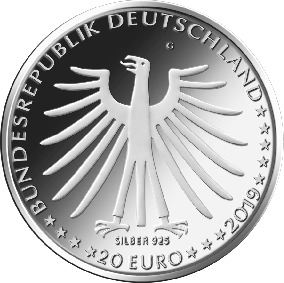

# Bekanntmachung über die Ausprägung von deutschen Euro-Gedenkmünzen im Nennwert von 20 Euro (Gedenkmünze „Tapferes Schneiderlein“) (Münz20EuroBek 2019-08-07)

Ausfertigungsdatum
:   2019-08-07

Fundstelle
:   BGBl I: 2019, 1398

## (XXXX)

Gemäß den §§ 2, 4 und 5 des Münzgesetzes vom 16. Dezember 1999 (BGBl.
I S. 2402) hat die Bundesregierung beschlossen, zum Thema „Tapferes
Schneiderlein“ eine deutsche Euro-Gedenkmünze im Nennwert von 20 Euro
prägen zu lassen. Diese Münze ist die achte Ausgabe im Rahmen der 2012
begonnenen Serie „200 Jahre Grimms Märchen“. Am 20. Dezember 1812
erschien der erste Band der Kinder- und Hausmärchen der Gebrüder
Grimm.

Die Auflage der Münze beträgt ca. 1,0 Millionen Stück, davon ca. 0,1
Millionen Stück in Spiegelglanzqualität. Die Prägung erfolgt durch die
Staatlichen Münzen Baden-Württemberg, Prägestätte Karlsruhe
(Prägezeichen G).

Die Münze wird ab dem 16. Mai 2019 in den Verkehr gebracht. Sie
besteht aus einer Legierung von 925 Tausendteilen Silber und 75
Tausendteilen Kupfer, hat einen Durchmesser von 32,5 Millimetern und
eine Masse von 18 Gramm. Das Gepräge auf beiden Seiten ist erhaben und
wird von einem schützenden, glatten Randstab umgeben.

Die Bildseite zeigt das tapfere Schneiderlein aus der Perspektive des
Endes der Geschichte. Die Figur trägt sowohl Attribute ihres
ursprünglichen Handwerks als auch die Krone als Symbol der erlangten
höchsten Herrscherstellung.

Die Wertseite zeigt einen Adler, den Schriftzug „BUNDESREPUBLIK
DEUTSCHLAND“, Wertziffer und Wertbezeichnung, das Prägezeichen „G“ der
Staatlichen Münzen Baden-Württemberg, Prägestätte Karlsruhe, die
Jahreszahl 2019 sowie die zwölf Europasterne. Auf der Wertseite der
Münze ist zusätzlich die Angabe „SILBER 925“ aufgeprägt.

Der glatte Münzrand enthält in vertiefter Prägung die Inschrift:

„SIEBENE AUF EINEN STREICH!“

Der Entwurf stammt von der Künstlerin Marianne Dietz aus Berlin.

## Schlussformel

Der Bundesminister der Finanzen

## (XXXX)

(Fundstelle: BGBl. I 2019, 1398)

*    *        
    *        

