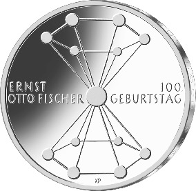
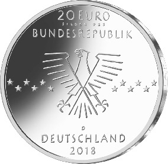

# Bekanntmachung über die Ausprägung von deutschen Euro-Gedenkmünzen im Nennwert von 20 Euro (Gedenkmünze „100. Geburtstag Ernst Otto Fischer“) (Münz20EuroBek 2019-08-07/1)

Ausfertigungsdatum
:   2019-08-07

Fundstelle
:   BGBl I: 2019, 1373

## (XXXX)

Gemäß den §§ 2, 4 und 5 des Münzgesetzes vom 16. Dezember 1999 (BGBl.
I S. 2402) hat die Bundesregierung beschlossen, zum Thema „100.
Geburtstag Ernst Otto Fischer“ eine deutsche Euro-Gedenkmünze im
Nennwert von 20 Euro prägen zu lassen. Die Münze würdigt Ernst Otto
Fischer (1918 – 2007), einen deutschen Chemiker und Professor für
Anorganische Chemie, der für seine Forschungen auf dem Gebiet der
Metall-Kohlenstoff-Bindungen gemeinsam mit dem Briten Geoffrey
Wilkinson mit dem Nobelpreis für Chemie (1973) ausgezeichnet wurde.

Die Auflage der Münze beträgt ca. 1,0 Millionen Stück, davon ca. 0,1
Millionen Stück in Spiegelglanzqualität. Die Prägung erfolgt durch das
Bayerische Hauptmünzamt, München (Prägezeichen D).

Die Münze wird ab dem 11. Oktober 2018 in den Verkehr gebracht. Sie
besteht aus einer Legierung von 925 Tausendteilen Silber und 75
Tausendteilen Kupfer, hat einen Durchmesser von 32,5 Millimetern und
eine Masse von 18 Gramm. Das Gepräge auf beiden Seiten ist erhaben und
wird von einem schützenden, glatten Randstab umgeben.

Die Bildseite zeigt ein künstlerisch transformiertes Modell der
epochalen Forschungsergebnisse Ernst Otto Fischers, des Dibenzolchroms
mit der Doppelkegelstruktur, für das er auch 1973 den Nobelpreis
erhielt.

Die Wertseite zeigt einen Adler, den Schriftzug „BUNDESREPUBLIK
DEUTSCHLAND“, Wertziffer und Wertbezeichnung, das Prägezeichen „D“ des
Bayerischen Hauptmünzamtes, München, die Jahreszahl 2018 sowie die
zwölf Europasterne. Auf der Wertseite der Münze ist zusätzlich die
Angabe „SILBER 925“ aufgeprägt.

Der glatte Münzrand enthält in vertiefter Prägung die Inschrift:

„NATURWISSENSCHAFTEN
SIND WEDER GUT NOCH BOESE*             “.

Der Entwurf stammt von der Künstlerin Katrin Pannicke aus Halle
(Saale).

## Schlussformel

Der Bundesminister der Finanzen

## (XXXX)

(Fundstelle: BGBl. I 2019, 1373)

*    *        
    *        

