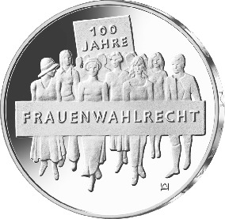
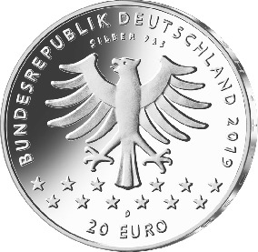

# Bekanntmachung über die Ausprägung von deutschen Euro-Gedenkmünzen im Nennwert von 20 Euro (Gedenkmünze „100 Jahre Frauenwahlrecht“) (Münz20EuroBek 2019-08-07/2)

Ausfertigungsdatum
:   2019-08-07

Fundstelle
:   BGBl I: 2019, 1374

## (XXXX)

Gemäß den §§ 2, 4 und 5 des Münzgesetzes vom 16. Dezember 1999 (BGBl.
I S. 2402) hat die Bundesregierung beschlossen, zum Thema „100 Jahre
Frauenwahlrecht“ eine deutsche Euro-Gedenkmünze im Nennwert von 20
Euro prägen zu lassen. Am 19. Januar 1919 konnten Frauen in
Deutschland bei der Wahl zur Deutschen Nationalversammlung erstmals
auf nationaler Ebene ihr Wahlrecht ausüben.

Die Auflage der Münze beträgt ca. 1,0 Millionen Stück, davon ca. 0,1
Millionen Stück in Spiegelglanzqualität. Die Prägung erfolgt durch das
Bayerische Hauptmünzamt, München (Prägezeichen D).

Die Münze wird ab dem 17. Januar 2019 in den Verkehr gebracht. Sie
besteht aus einer Legierung von 925 Tausendteilen Silber und 75
Tausendteilen Kupfer, hat einen Durchmesser von 32,5 Millimetern und
eine Masse von 18 Gramm. Das Gepräge auf beiden Seiten ist erhaben und
wird von einem schützenden, glatten Randstab umgeben.

Die Bildseite zeigt eine Gruppe von Frauen, die wie in einem
Demonstrationszug auf den Betrachter zuläuft. Die Durchsetzung des
Wahlrechtes war jedoch vielen engagierten Persönlichkeiten zu
verdanken. Daher zeigt die Münze auch keinen Demonstrationszug in
einer konkreten historischen Situation, sondern eine Gruppe von Frauen
aus verschiedenen Zeiten, an der Mode kenntlich, die bis heute für
eine gleichberechtigte Teilhabe an politischen Prozessen kämpft.

Die Wertseite zeigt einen Adler, den Schriftzug „BUNDESREPUBLIK
DEUTSCHLAND“, Wertziffer und Wertbezeichnung, das Prägezeichen „D“ des
Bayerischen Hauptmünzamtes, München, die Jahreszahl 2019 sowie die
zwölf Europasterne. Auf der Wertseite der Münze ist zusätzlich die
Angabe „SILBER 925“ aufgeprägt.

Der glatte Münzrand enthält in vertiefter Prägung die Inschrift:

„HERAUS MIT DEM FRAUENWAHLRECHT*             “.

Der Entwurf stammt von der Künstlerin Anne Karen Hentschel aus Bremen.

## Schlussformel

Der Bundesminister der Finanzen

## (XXXX)

(Fundstelle: BGBl. I 2019, 1374)

*    *        
    *        

*    *
    *

