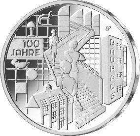
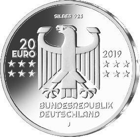

# Bekanntmachung über die Ausprägung von deutschen Euro-Gedenkmünzen im Nennwert von 20 Euro (Gedenkmünze „100 Jahre Bauhaus“) (Münz20EuroBek 2019-08-07/3)

Ausfertigungsdatum
:   2019-08-07

Fundstelle
:   BGBl I: 2019, 1375

## (XXXX)

Gemäß den §§ 2, 4 und 5 des Münzgesetzes vom 16. Dezember 1999 (BGBl.
I S. 2402) hat die Bundesregierung beschlossen, zum Thema „100 Jahre
Bauhaus“ eine deutsche Euro-Gedenkmünze im Nennwert von 20 Euro prägen
zu lassen. Die Münze würdigt die Gründung des Bauhauses durch Walter
Gropius am 1. April 1919.

Die Auflage der Münze beträgt ca. 1,0 Millionen Stück, davon ca. 0,1
Millionen Stück in Spiegelglanzqualität. Die Prägung erfolgt durch die
Hamburgische Münze (Prägezeichen J).

Die Münze wird ab dem 14. März 2019 in den Verkehr gebracht. Sie
besteht aus einer Legierung von 925 Tausendteilen Silber und 75
Tausendteilen Kupfer, hat einen Durchmesser von 32,5 Millimetern und
eine Masse von 18 Gramm. Das Gepräge auf beiden Seiten ist erhaben und
wird von einem schützenden, glatten Randstab umgeben.

Die Darstellung auf der Bildseite führt in eine ereignisreiche und
spannungsvolle Welt des Bauhauses. Sie umfasst sämtliche Bereiche der
künstlerischen Gestaltung, die das Bauhaus zu einem Gesamtkunstwerk
vereinigen wollte. Die Münze gerät durch diese inhaltliche
Vielschichtigkeit zu einer Erlebniswelt im Miniaturformat, die den
Betrachter durch 100 Jahre Bauhaus begleitet.

Die Wertseite zeigt einen Adler, den Schriftzug „BUNDESREPUBLIK
DEUTSCHLAND“, Wertziffer und Wertbezeichnung, das Prägezeichen „J“ der
Hamburgischen Münze, die Jahreszahl 2019 sowie die zwölf Europasterne.
Auf der Wertseite der Münze ist zusätzlich die Angabe „SILBER 925“
aufgeprägt.

Der glatte Münzrand enthält in vertiefter Prägung die Inschrift:

„DIE WELT NEU DENKEN*             “.

Der Entwurf stammt von dem Künstler Bastian Prillwitz aus Berlin.

## Schlussformel

Der Bundesminister der Finanzen

## (XXXX)

(Fundstelle: BGBl. I 2019, 1375)

*    *        
    *        

