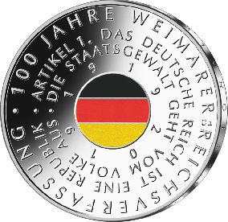
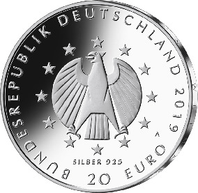

# Bekanntmachung über die Ausprägung von deutschen Euro-Gedenkmünzen im Nennwert von 20 Euro (Gedenkmünze „100 Jahre Weimarer Reichsverfassung“) (Münz20EuroBek 2019-08-07/5)

Ausfertigungsdatum
:   2019-08-07

Fundstelle
:   BGBl I: 2019, 1382

## (XXXX)

Gemäß den §§ 2, 4 und 5 des Münzgesetzes vom 16. Dezember 1999 (BGBl.
I S. 2402) hat die Bundesregierung beschlossen, zum Thema „100 Jahre
Weimarer Reichsverfassung“ eine deutsche Euro-Gedenkmünze im Nennwert
von 20 Euro prägen zu lassen. Die Münze würdigt das 100. Jubiläum des
Inkrafttretens der ersten demokratischen Verfassung Deutschlands.

Die Auflage der Münze beträgt ca. 1,0 Millionen Stück, davon ca. 0,1
Millionen Stück in Spiegelglanzqualität. Die Prägung erfolgt durch die
Staatliche Münze Berlin (Prägezeichen A).

Die Münze wird ab dem 8. August 2019 in den Verkehr gebracht. Sie
besteht aus einer Legierung von 925 Tausendteilen Silber und 75
Tausendteilen Kupfer, hat einen Durchmesser von 32,5 Millimetern und
eine Masse von 18 Gramm. Das Gepräge auf beiden Seiten ist erhaben und
wird von einem schützenden, glatten Randstab umgeben.

Im Zentrum der Bildseite findet sich ein Ausschnitt der durch die
Weimarer Reichsverfassung eingeführten Flagge, die – als erstes
Motivelement auf einer Silbermünze der Bundesrepublik Deutschland –
farbig dargestellt wird. Die Farbigkeit ist dabei nicht bloßes Dekor,
sondern bringt die in den Reichsfarben symbolisierten Entscheidungen
für die Republik und die Demokratie zum Ausdruck. Der in einer
rosettenhaften Anordnung zitierte Artikel 1 der Reichsverfassung
bringt die beiden zentralen Ergebnisse der Revolution von 1918 auf den
Punkt: den Übergang von der Monarchie zur Republik und die
Legitimation der Staatsgewalt durch das Prinzip der Volkssouveränität.

Die Wertseite zeigt einen Adler, den Schriftzug „BUNDESREPUBLIK
DEUTSCHLAND“, Wertziffer und Wertbezeichnung, das Prägezeichen „A“ der
Staatlichen Münze Berlin, die Jahreszahl 2019 sowie die zwölf
Europasterne. Auf der Wertseite der Münze ist zusätzlich die Angabe
„SILBER 925“ aufgeprägt.

Der glatte Münzrand enthält in vertiefter Prägung die Inschrift:

„NATIONALVERSAMMLUNG WEIMAR 1919*             “.

Der Entwurf stammt von dem Künstler Frantisek Chochola aus Hamburg.

## Schlussformel

Der Bundesminister der Finanzen

## (XXXX)

(Fundstelle: BGBl. I 2019, 1382)

*    *        
    *        

