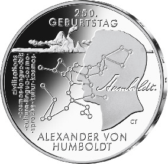
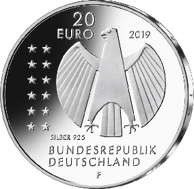

# Bekanntmachung über die Ausprägung von deutschen Euro-Gedenkmünzen im Nennwert von 20 Euro (Gedenkmünze „250. Geburtstag Alexander von Humboldt“) (Münz20EuroBek 2019-08-28)

Ausfertigungsdatum
:   2019-08-28

Fundstelle
:   BGBl I: 2019, 1399

## (XXXX)

Gemäß den §§ 2, 4 und 5 des Münzgesetzes vom 16. Dezember 1999 (BGBl.
I S. 2402) hat die Bundesregierung beschlossen, zum Thema „250.
Geburtstag Alexander von Humboldt“ eine deutsche Euro-Gedenkmünze im
Nennwert von 20 Euro prägen zu lassen. Die Münze würdigt Alexander von
Humboldt (14. September 1769 bis 6. Mai 1859), den großen deutschen
Forscher und Gelehrten.

Die Auflage der Münze beträgt ca. 1,0 Millionen Stück, davon ca. 0,1
Millionen Stück in Spiegelglanzqualität. Die Prägung erfolgt durch die
Staatlichen Münzen Baden-Württemberg, Prägestätte Stuttgart
(Prägezeichen F).

Die Münze wird ab dem 5. September 2019 in den Verkehr gebracht. Sie
besteht aus einer Legierung von 925 Tausendteilen Silber und 75
Tausendteilen Kupfer, hat einen Durchmesser von 32,5 Millimetern und
eine Masse von 18 Gramm. Das Gepräge auf beiden Seiten ist erhaben und
wird von einem schützenden, glatten Randstab umgeben.

Auf der Bildseite wird das Schlüsselzitat aus Alexander von Humboldts
Reisetagebüchern „Alles ist Wechselwirkung“ in eine sehr gelungene
Bildsprache umgesetzt. Der Entwurf vermittelt zwischen originalem
Bildmaterial und unserem heutigen Verständnis von Humboldts weltweitem
Wirken.

Die Wertseite zeigt einen Adler, den Schriftzug „BUNDESREPUBLIK
DEUTSCHLAND“, Wertziffer und Wertbezeichnung, das Prägezeichen „F“ der
Staatlichen Münzen Baden-Württemberg, Prägestätte Stuttgart, die
Jahreszahl 2019 sowie die zwölf Europasterne. Zusätzlich ist die
Angabe „SILBER 925“ aufgeprägt.

Der glatte Münzrand enthält in vertiefter Prägung die Inschrift:

„ALLES IST WECHSELWIRKUNG*             “.

Der Entwurf der Münze stammt von dem Künstler Carsten Theumer aus
Salzatal/OT Höhnstedt.

## Schlussformel

Der Bundesminister der Finanzen

## (XXXX)

(Fundstelle: BGBl. I 2019, 1399)

*    *        
    *        

