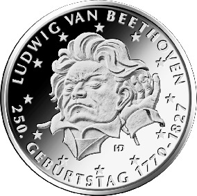
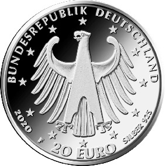

# Bekanntmachung über die Ausprägung von deutschen Euro-Gedenkmünzen im Nennwert von 20 Euro (Gedenkmünze „250. Geburtstag Ludwig van Beethoven“) (Münz20EuroBek 2020-01-22/1)

Ausfertigungsdatum
:   2020-01-22

Fundstelle
:   BGBl I: 2020, 133

## (XXXX)

Gemäß den §§ 2, 4 und 5 des Münzgesetzes vom 16. Dezember 1999 (BGBl.
I S. 2402) hat die Bundesregierung beschlossen, zum Thema „250.
Geburtstag Ludwig van Beethoven“ eine deutsche Euro-Gedenkmünze im
Nennwert von 20 Euro prägen zu lassen. Die Münze würdigt Ludwig van
Beethoven (1770 – 1827), den großen deutschen Komponisten und
Pianisten.

Die Auflage der Münze beträgt ca. 1,0 Millionen Stück, davon ca. 0,1
Millionen Stück in Spiegelglanzqualität. Die Prägung erfolgt durch die
Staatlichen Münzen Baden-Württemberg, Prägestätte Stuttgart
(Prägezeichen F).

Die Münze wird ab dem 20. Februar 2020 in den Verkehr gebracht. Sie
besteht aus einer Legierung von 925 Tausendteilen Silber und 75
Tausendteilen Kupfer, hat einen Durchmesser von 32,5 Millimetern und
eine Masse von 18 Gramm. Das Gepräge auf beiden Seiten ist erhaben und
wird von einem schützenden, glatten Randstab umgeben.

Auf der Bildseite wird eine sehr kraftvolle und präsente Darstellung
des Komponisten Ludwig van Beethoven mit einer Geste umgesetzt, die
verschiedene Deutungen zulässt. Gezeigt wird der Jubilar, wie er
konzentriert zuhört und das Gehörte verinnerlicht. Gleichzeitig wird
der Betrachter eingeladen zu hören.

Die Wertseite zeigt einen Adler, den Schriftzug „BUNDESREPUBLIK
DEUTSCHLAND“, Wertziffer und Wertbezeichnung, das Prägezeichen „F“ der
Staatlichen Münzen Baden-Württemberg, Prägestätte Stuttgart, die
Jahreszahl 2020 sowie die zwölf Europasterne. Zusätzlich ist die
Angabe „SILBER 925“ aufgeprägt.

Der glatte Münzrand enthält in vertiefter Prägung die Inschrift:

„WAHRE KUNST BLEIBT UNVERGAENGLICH*             “.

Der Entwurf der Münze stammt von dem Künstler Hannes Dauer aus
Schönbrunn-Steinsdorf.

## Schlussformel

Der Bundesminister der Finanzen

## (XXXX)

(Fundstelle: BGBl. I 2020, 133)

*    *        
    *        

