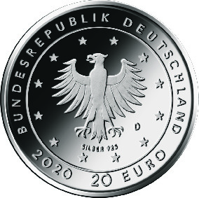

# Bekanntmachung über die Ausprägung von deutschen Euro-Gedenkmünzen im Nennwert von 20 Euro (Gedenkmünze „Der Wolf und die sieben Geißlein“) (Münz20EuroBek 2020-01-22/2)

Ausfertigungsdatum
:   2020-01-22

Fundstelle
:   BGBl I: 2020, 134

## (XXXX)

Gemäß den §§ 2, 4 und 5 des Münzgesetzes vom 16. Dezember 1999 (BGBl.
I S. 2402) hat die Bundesregierung beschlossen, zum Thema „Der Wolf
und die sieben Geißlein“ eine deutsche Euro-Gedenkmünze im Nennwert
von 20 Euro prägen zu lassen. Die Münze ist die neunte Ausgabe im
Rahmen der 2012 begonnenen Serie „200 Jahre Grimms Märchen“.

Die Auflage der Münze beträgt ca. 1,0 Millionen Stück, davon ca. 0,1
Millionen Stück in Spiegelglanzqualität. Die Prägung erfolgt durch das
Bayerische Hauptmünzamt, München.

Die Münze wird ab dem 16. Januar 2020 in den Verkehr gebracht. Sie
besteht aus einer Legierung von 925 Tausendteilen Silber und 75
Tausendteilen Kupfer, hat einen Durchmesser von 32,5 Millimetern und
eine Masse von 18 Gramm. Das Gepräge auf beiden Seiten ist erhaben und
wird von einem schützenden, glatten Randstab umgeben.

Die Bildseite zeigt die dominierende Wolfsfigur sowie die zu Tode
erschrockenen Geißlein. Durch das fliehende Geißlein wird gleichzeitig
auf den Fortgang der Geschichte verwiesen.

Die Wertseite zeigt einen Adler, den Schriftzug „BUNDESREPUBLIK
DEUTSCHLAND“, Wertziffer und Wertbezeichnung, das Prägezeichen „D“ des
Bayerischen Hauptmünzamtes, München, die Jahreszahl 2020 sowie die
zwölf Europasterne. Zusätzlich ist die Angabe „SILBER 925“ aufgeprägt.

Der glatte Münzrand enthält in vertiefter Prägung die Inschrift:

„DU BIST DER WOLF \*“.

Der Entwurf der Münze stammt von der Künstlerin Adelheid Fuss aus
Potsdam.

## Schlussformel

Der Bundesminister der Finanzen

## (XXXX)

(Fundstelle: BGBl. I 2020, 134)

*    *        
    *        

