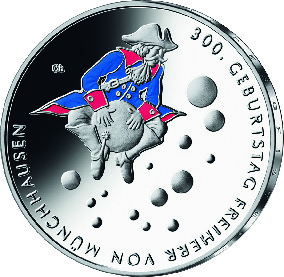
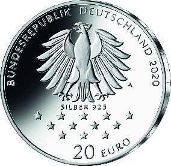

# Bekanntmachung über die Ausprägung von deutschen Euro-Gedenkmünzen im Nennwert von 20 Euro (Gedenkmünze „300. Geburtstag Freiherr von Münchhausen“) (Münz20EuroBek 2020-08-20)

Ausfertigungsdatum
:   2020-08-20

Fundstelle
:   BGBl I: 2020, 2010

## (XXXX)

Gemäß den §§ 2, 4 und 5 des Münzgesetzes vom 16. Dezember 1999 (BGBl.
I S. 2402) hat die Bundesregierung beschlossen, zum Thema „300.
Geburtstag Freiherr von Münchhausen“ eine deutsche Euro-Gedenkmünze im
Nennwert von 20 Euro prägen zu lassen. Die Münze würdigt den
begnadeten Geschichtenerzähler Hieronymus Carl Friedrich Freiherr von
Münchhausen (1720 – 1797).

Die Auflage der Münze beträgt ca. 1,0 Millionen Stück, davon ca. 0,1
Millionen Stück in Spiegelglanzqualität. Die Prägung erfolgt durch die
Staatliche Münze Berlin (Prägezeichen A).

Die Münze wird ab dem 7. Mai 2020 in den Verkehr gebracht. Sie besteht
aus einer Legierung von 925 Tausendteilen Silber und 75 Tausendteilen
Kupfer, hat einen Durchmesser von 32,5 Millimetern und eine Masse von
18 Gramm. Das Gepräge auf beiden Seiten ist erhaben und wird von einem
schützenden, glatten Randstab umgeben.

Die Bildseite zeigt den Ritt auf der Kanonenkugel, der durch die stark
perspektivische Tiefenwirkung und Klarheit wie ein Flug durch Raum und
Zeit erscheint. Dramaturgisch wird dieser Flug Münchhausens zum
farbigen Höhepunkt des Münzraumes. Das farbig gestaltete Motivelement
verstärkt die visuelle Attraktivität.

Die Wertseite zeigt einen Adler, den Schriftzug „BUNDESREPUBLIK
DEUTSCHLAND“, Wertziffer und Wertbezeichnung, das Prägezeichen „A“ der
Staatlichen Münze Berlin, die Jahreszahl 2020 sowie die zwölf
Europasterne. Zusätzlich ist die Angabe „SILBER 925“ aufgeprägt.

Der glatte Münzrand enthält in vertiefter Prägung die Inschrift:

„MIT TAPFERKEIT UND
GEGENWART DES GEISTES*             “.

Der Entwurf der Münze stammt von dem Künstler Frantisek Chochola aus
Hamburg.

## Schlussformel

Der Bundesminister der Finanzen

## (XXXX)

(Fundstelle: BGBl. I 2020, 2010)

*    *        
    *        

