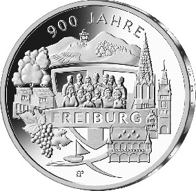
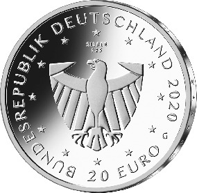

# Bekanntmachung über die Ausprägung von deutschen Euro-Gedenkmünzen im Nennwert von 20 Euro (Gedenkmünze „900 Jahre Freiburg“) (Münz20EuroBek 2020-08-20/2)

Ausfertigungsdatum
:   2020-08-20

Fundstelle
:   BGBl I: 2020, 2041

## (XXXX)

Gemäß den §§ 2, 4 und 5 des Münzgesetzes vom 16. Dezember 1999 (BGBl.
I S. 2402) hat die Bundesregierung beschlossen, zum Thema „900 Jahre
Freiburg“ eine deutsche Euro-Gedenkmünze im Nennwert von 20 Euro
prägen zu lassen. Die Münze würdigt das 900. Stadtjubiläum von
Freiburg. Im Jahre 1120 wurde Freiburg mit dem Marktrecht ausgestattet
und zur Stadt erhoben.

Die Auflage der Münze beträgt ca. 1,0 Millionen Stück, davon ca. 0,1
Millionen Stück in Spiegelglanzqualität. Die Prägung erfolgt durch die
Staatlichen Münzen Baden-Württemberg, Prägestätte Karlsruhe
(Prägezeichen G).

Die Münze wird ab dem 9. Juli 2020 in den Verkehr gebracht. Sie
besteht aus einer Legierung von 925 Tausendteilen Silber und 75
Tausendteilen Kupfer, hat einen Durchmesser von 32,5 Millimetern und
eine Masse von 18 Gramm. Das Gepräge auf beiden Seiten ist erhaben und
wird von einem schützenden, glatten Randstab umgeben.

Die Bildseite stellt die Bürgerschaft Freiburgs vor dem Stadtwappen in
den Mittelpunkt. Auf der rechten Seite werden die markanten
historischen Gebäude und auf der linken Seite die naturverbundenen
Elemente der ökologischen Stadt gezeigt. Der Blick öffnet sich nach
oben zum Schlossbergturm und thematisiert unten die Freiburger Bächle.

Die Wertseite zeigt einen Adler, den Schriftzug „BUNDESREPUBLIK
DEUTSCHLAND“, Wertziffer und Wertbezeichnung, das Prägezeichen „G“ der
Staatlichen Münzen Baden-Württemberg, Prägestätte Karlsruhe, die
Jahreszahl 2020 sowie die zwölf Europasterne. Zusätzlich ist die
Angabe „SILBER 925“ aufgeprägt.

Der glatte Münzrand enthält in vertiefter Prägung die Inschrift:

„DER BUERGER WOHL SEI OBERSTES GESETZ +“.

Der Entwurf der Münze stammt von dem Künstler Bastian Prillwitz aus
Berlin.

## Schlussformel

Der Bundesminister der Finanzen

## Anlage

(Fundstelle: BGBl. I 2020, 2041)

*    *        
    *        

