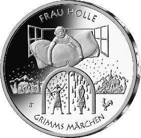
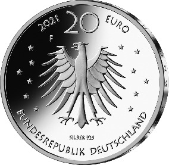

# Bekanntmachung über die Ausprägung von deutschen Euro-Gedenkmünzen im Nennwert von 20 Euro (Gedenkmünze „Frau Holle“) (Münz20EuroBek 2021-02-08/1)

Ausfertigungsdatum
:   2021-02-08

Fundstelle
:   BGBl I: 2021, 259

## (XXXX)

Gemäß den §§ 2, 4 und 5 des Münzgesetzes vom 16. Dezember 1999 (BGBl.
I S. 2402) hat die Bundesregierung beschlossen, zum Thema „Frau Holle“
eine deutsche Euro-Gedenkmünze im Nennwert von 20 Euro prägen zu
lassen. Die Münze ist die zehnte Ausgabe im Rahmen der 2012 begonnenen
Serie „200 Jahre Grimms Märchen“.

Die Auflage der Münze beträgt ca. 1,0 Millionen Stück, davon ca. 0,1
Millionen Stück in Spiegelglanzqualität. Die Prägung erfolgt durch die
Staatlichen Münzen Baden-Württemberg, Prägestätte Stuttgart
(Prägezeichen F).

Die Münze wird ab dem 21. Januar 2021 in den Verkehr gebracht. Sie
besteht aus einer Legierung von 925 Tausendteilen Silber und 75
Tausendteilen Kupfer, hat einen Durchmesser von 32,5 Millimetern und
eine Masse von 18 Gramm. Das Gepräge auf beiden Seiten ist erhaben und
wird von einem schützenden, glatten Randstab umgeben.

Die Bildseite zeigt Frau Holle bei ihrer typischen Tätigkeit. Trotz
der Fülle der Bildelemente wird eine große Klarheit und
Wiedererkennbarkeit des Märchens erreicht.

Die Wertseite zeigt einen Adler, den Schriftzug „BUNDESREPUBLIK
DEUTSCHLAND“, Wertziffer und Wertbezeichnung, das Prägezeichen „F“ der
Staatlichen Münzen Baden-Württemberg, Prägestätte Stuttgart, die
Jahreszahl 2021 sowie die zwölf Europasterne. Zusätzlich ist die
Angabe „SILBER 925“ aufgeprägt.

Der glatte Münzrand enthält in vertiefter Prägung die Inschrift:

„DAS IST ZUR BELOHNUNG DEINER DIENSTE \*“.

Der Entwurf stammt von dem Künstler Jordi Truxa aus Neuenhagen.

## Schlussformel

Der Bundesminister der Finanzen

## (XXXX)

(Fundstelle: BGBl. I 2021, 259)

*    *        
    *        

*    *
    *

