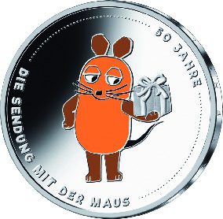
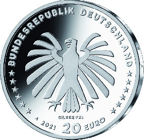

# Bekanntmachung über die Ausprägung von deutschen Euro-Gedenkmünzen im Nennwert von 20 Euro (Gedenkmünze „50 Jahre Sendung mit der Maus“) (Münz20EuroBek 2021-02-08/2)

Ausfertigungsdatum
:   2021-02-08

Fundstelle
:   BGBl I: 2021, 260

## (XXXX)

Gemäß den §§ 2, 4 und 5 des Münzgesetzes vom 16. Dezember 1999 (BGBl.
I S. 2402) hat die Bundesregierung beschlossen, zum Thema „50 Jahre
Sendung mit der Maus“ eine deutsche Euro-Gedenkmünze im Nennwert von
20 Euro prägen zu lassen. Die Münze würdigt das 50-jährige Jubiläum
der bekannten Kindersendung, deren Erstausstrahlung am 7. März 1971 im
Westdeutschen Rundfunk stattfand.

Die Auflage der Münze beträgt ca. 1,0 Millionen Stück, davon ca. 0,1
Millionen Stück in Spiegelglanzqualität. Die Prägung erfolgt durch die
Staatliche Münze Berlin (Prägezeichen A).

Die Münze wird ab dem 25. Februar 2021 in den Verkehr gebracht. Sie
besteht aus einer Legierung von 925 Tausendteilen Silber und 75
Tausendteilen Kupfer, hat einen Durchmesser von 32,5 Millimetern und
eine Masse von 18 Gramm. Das Gepräge auf beiden Seiten ist erhaben und
wird von einem schützenden, glatten Randstab umgeben.

Die Bildseite zeigt „die Maus“ in der Mitte des Münzrunds. Das in
ihrem linken Arm befindliche Geschenk stellt den unmittelbaren
Zusammenhang zum Anlass dar. Die Maus blickt verschmitzt in die
Richtung des Geschenks und strahlt Ihre Neugierde – eine zentrale
Eigenschaft der Figur – aus. Die Kolorierung der Maus in den
charakteristischen Farben erhöht den Wiedererkennungswert.

Die Wertseite zeigt einen Adler, den Schriftzug „BUNDESREPUBLIK
DEUTSCHLAND“, Wertziffer und Wertbezeichnung, das Prägezeichen „A“ der
Staatlichen Münze Berlin, die Jahreszahl 2021 sowie die zwölf
Europasterne. Zusätzlich ist die Angabe „SILBER 925“ aufgeprägt.

Der glatte Münzrand enthält in vertiefter Prägung die Inschrift:

„LACH- UND SACHGESCHICHTEN*             “.

Die Bildseite wurde von der WDR mediagroup GmbH und der Staatlichen
Münze Berlin gestaltet, die Wertseite beruht auf einem Entwurf des
Künstlers Andre Witting aus Berlin.

## Schlussformel

Der Bundesminister der Finanzen

## (XXXX)

(Fundstelle: BGBl. I 2021, 260)

*    *        
    *        

*    *
    *

