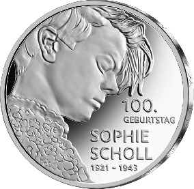
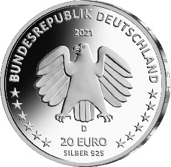

# Bekanntmachung über die Ausprägung von deutschen Euro-Gedenkmünzen im Nennwert von 20 Euro (Gedenkmünze „100. Geburtstag Sophie Scholl“) (Münz20EuroBek 2021-04-23)

Ausfertigungsdatum
:   2021-04-23

Fundstelle
:   BGBl I: 2021, 957

## (XXXX)

Gemäß den §§ 2, 4 und 5 des Münzgesetzes vom 16. Dezember 1999 (BGBl.
I S. 2402) hat die Bundesregierung beschlossen, zum Thema „100.
Geburtstag Sophie Scholl“ eine deutsche Euro-Gedenkmünze im Nennwert
von 20 Euro prägen zu lassen. Die Münze würdigt Sophie Scholl (9. Mai
1921 – 22. Februar 1943), die zu den bekanntesten deutschen
Widerstandskämpferinnen gegen das NS-Regime zählt und vielen Menschen
bis heute ein Vorbild für den Kampf gegen Unfreiheit und Unterdrückung
ist.

Die Auflage der Münze beträgt ca. 1,0 Millionen Stück, davon ca. 0,1
Millionen Stück in Spiegelglanzqualität. Die Prägung erfolgt durch das
Bayerische Hauptmünzamt, München (Prägezeichen D).

Die Münze wird ab dem 22. April 2021 in den Verkehr gebracht. Sie
besteht aus einer Legierung von 925 Tausendteilen Silber und 75
Tausendteilen Kupfer, hat einen Durchmesser von 32,5 Millimetern und
eine Masse von 18 Gramm. Das Gepräge auf beiden Seiten ist erhaben und
wird von einem schützenden, glatten Randstab umgeben.

Die Bildseite zeigt ein Porträt von Sophie Scholl, das ihre
Persönlichkeit treffend charakterisiert. Die junge Frau signalisiert
schon durch ihre äußere Erscheinung geistige Unabhängigkeit, Klarheit
und Weisheit und die Kraft, zu ihren humanitären Prinzipien auch in
höchster Lebensgefahr zu stehen.

Die Wertseite zeigt einen Adler, den Schriftzug „BUNDESREPUBLIK
DEUTSCHLAND“, Wertziffer und Wertbezeichnung, das Prägezeichen „D“ des
Bayerischen Hauptmünzamtes, München, die Jahreszahl 2021 sowie die
zwölf Europasterne. Zusätzlich ist die Angabe „SILBER 925“ aufgeprägt.

Der glatte Münzrand enthält in vertiefter Prägung die Inschrift:

„EIN GEFUEHL WAS RECHT UND UNRECHT IST•“.

Der Entwurf der Münze stammt von dem Künstler Olaf Stoy aus Rabenau.

## Schlussformel

Der Bundesminister der Finanzen

## (XXXX)

(Fundstelle: BGBl. I 2021, 957)

*    *        
    *        

