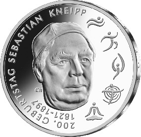
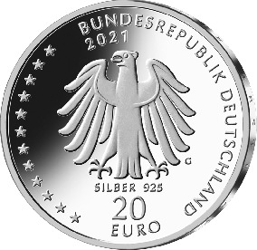

# Bekanntmachung über die Ausprägung von deutschen Euro-Gedenkmünzen im Nennwert von 20 Euro (Gedenkmünze „200. Geburtstag Sebastian Kneipp“) (Münz20EuroBek 2021-04-23/1)

Ausfertigungsdatum
:   2021-04-23

Fundstelle
:   BGBl I: 2021, 983

## (XXXX)

Gemäß den §§ 2, 4 und 5 des Münzgesetzes vom 16. Dezember 1999 (BGBl.
I S. 2402) hat die Bundesregierung beschlossen, zum Thema „200.
Geburtstag Sebastian Kneipp“ eine deutsche Euro-Gedenkmünze im
Nennwert von 20 Euro prägen zu lassen. Die Münze würdigt Sebastian
Kneipp (17. Mai 1821 – 17. Juni 1897), den Namensgeber der Kneipp-
Medizin und bekannten Hydrotherapeuten und Naturheilkundler, dessen
Geburtstag sich am 17. Mai 2021 zum 200. Mal jährt.

Die Auflage der Münze beträgt ca. 1,0 Millionen Stück, davon ca. 0,1
Millionen Stück in Spiegelglanzqualität. Die Prägung erfolgt durch die
Staatlichen Münzen Baden-Württemberg, Prägestätte Karlsruhe
(Prägezeichen G).

Die Münze wird ab dem 20. Mai 2021 in den Verkehr gebracht. Sie
besteht aus einer Legierung von 925 Tausendteilen Silber und 75
Tausendteilen Kupfer, hat einen Durchmesser von 32,5 Millimetern und
eine Masse von 18 Gramm. Das Gepräge auf beiden Seiten ist erhaben und
wird von einem schützenden, glatten Randstab umgeben.

Die Bildseite des Entwurfs zeigt ein würdevolles, klassisches Porträt
Sebastian Kneipps, das den modernen Signets der fünf Elemente seines
naturheilkundlichen Gesundheitskonzepts gegenübersteht. So wird ein
Spannungsbogen deutlich zwischen Kneipps Wirken und der
kontinuierlichen Weiterentwicklung seiner Lehre bis in die heutige
Zeit.

Die Wertseite zeigt einen Adler, den Schriftzug „BUNDESREPUBLIK
DEUTSCHLAND“, Wertziffer und Wertbezeichnung, das Prägezeichen „G“ der
Staatlichen Münzen Baden-Württemberg, Prägestätte Karlsruhe, die
Jahreszahl 2021 sowie die zwölf Europasterne. Zusätzlich ist die
Angabe „SILBER 925“ aufgeprägt.

Der glatte Münzrand enthält in vertiefter Prägung die Inschrift:

„DIE NATUR IST DIE BESTE APOTHEKE •“.

Der Entwurf der Münze stammt von dem Künstler Frantisek Chochola aus
Hamburg.

## Schlussformel

Der Bundesminister der Finanzen

## (XXXX)

(Fundstelle: BGBl. I 2021, 983)

*    *        
    *        

