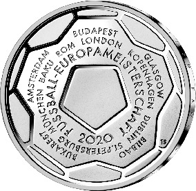
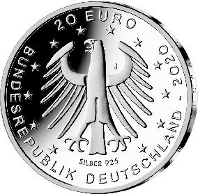

# Bekanntmachung über die Ausprägung von deutschen Euro-Gedenkmünzen im Nennwert von 20 Euro (Gedenkmünze „Fußball-Europameisterschaft 2020“) (Münz20EuroBek 2021-06-21/1)

Ausfertigungsdatum
:   2021-06-21

Fundstelle
:   BGBl I: 2021, 2263

## (XXXX)

Gemäß den §§ 2, 4 und 5 des Münzgesetzes vom 16. Dezember 1999 (BGBl.
I S. 2402) hat die Bundesregierung beschlossen, zum Thema „Fußball-
Europameisterschaft 2020“ eine deutsche Euro-Gedenkmünze im Nennwert
von 20 Euro prägen zu lassen. Die Münze würdigt eines der populärsten
sportlichen Großereignisse, die Fußball-Europameisterschaft, die
aufgrund der Coronavirus-Pandemie erst im Jahr 2021 ausgetragen wird.

Die Auflage der Münze beträgt ca. 1,0 Millionen Stück, davon ca. 0,1
Millionen Stück in Spiegelglanzqualität. Die Prägung erfolgt durch die
Hamburgische Münze (Prägezeichen J).

Die Münze wird ab dem 10. Juni 2021 in den Verkehr gebracht. Sie
besteht aus einer Legierung von 925 Tausendteilen Silber und 75
Tausendteilen Kupfer, hat einen Durchmesser von 32,5 Millimetern und
eine Masse von 18 Gramm. Das Gepräge auf beiden Seiten ist erhaben und
wird von einem schützenden, glatten Randstab umgeben.

Die Bildseite verfolgt den Ansatz, die Münze in ihrer Gesamtform als
Fußball darzustellen. Die Anordnung und die Auswahl der Schrift, die
Bezug nimmt auf die Wertseite mit ihrer würdigen Adlerdarstellung,
fügen sich sehr gut in das Gesamtbild der Münze ein. Die Nennung der
12 Austragungsorte auf der Münze unterstreicht die Besonderheit dieser
länderübergreifenden Fußball-Europameisterschaft.

Die Wertseite zeigt einen Adler, den Schriftzug „BUNDESREPUBLIK
DEUTSCHLAND“, Wertziffer und Wertbezeichnung, das Prägezeichen „J“ der
Hamburgischen Münze, die Jahreszahl 2020 sowie die zwölf Europasterne.
Zusätzlich ist die Angabe „SILBER 925“ aufgeprägt.

Der glatte Münzrand enthält in vertiefter Prägung die Inschrift:

„EIN TURNIER FUER EUROPA •
EIN TURNIER FUER FANS •“.

Der Entwurf der Bildseite stammt von dem Künstler Thomas Serres aus
Hattingen. Die Wertseite wurde von dem Künstler Erich Ott aus München
gestaltet.

## Schlussformel

Der Bundesminister der Finanzen

## (XXXX)

(Fundstelle: BGBl. I 2021, 2263)

*    *        
    *        

