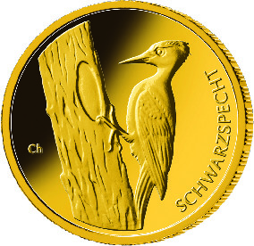
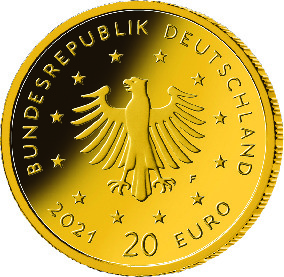

# Bekanntmachung über die Ausprägung von deutschen Euro-Gedenkmünzen im Nennwert von 20 Euro (Goldmünze „Schwarzspecht“ der Serie „Heimische Vögel“) (Münz20EuroBek 2021-06-21/2)

Ausfertigungsdatum
:   2021-06-21

Fundstelle
:   BGBl I: 2021, 2264

## (XXXX)

Gemäß den §§ 2, 4 und 5 des Münzgesetzes vom 16. Dezember 1999 (BGBl.
I S. 2402) hat die Bundesregierung beschlossen, eine 20-Euro-Goldmünze
„Schwarzspecht“ prägen zu lassen. Diese Münze ist die sechste und
zugleich letzte Ausgabe der im Jahr 2016 begonnenen Serie „Heimische
Vögel“ (2016-2021, eine Ausgabe pro Jahr). Die Münze wird ab dem 21.
Juni 2021 in den Verkehr gebracht.

Die limitierte Auflage der 20-Euro-Goldmünze „Schwarzspecht“ beträgt
maximal 150 000 Stück. Die Münze wird zu gleichen Teilen in den
Münzstätten Berlin (Münzzeichen „A“), München (Münzzeichen „D“),
Stuttgart (Münzzeichen „F“), Karlsruhe (Münzzeichen „G“) und Hamburg
(Münzzeichen „J“) in Stempelglanzausführung geprägt.

Sie besteht aus Gold mit einem Feingehalt von 999,9 Tausendteilen
(Feingold), hat einen Durchmesser von 17,5 Millimetern und eine Masse
von 3,89 Gramm. Der Münzrand ist geriffelt.

Auf der Bildseite wird ein Schwarzspecht dargestellt. Der Entwurf der
Bildseite stammt von dem Künstler František Chochola aus Hamburg.

Die Wertseite, die bei allen Münzen der Serie identisch ist, wurde von
der Künstlerin Adelheid Fuss aus Geltow gestaltet. Sie zeigt einen
Adler, den Schriftzug „BUNDESREPUBLIK DEUTSCHLAND“, die zwölf
Europasterne, die Wertziffer mit der Euro-Bezeichnung sowie die
Jahreszahl „2021“ und – je nach Münzstätte – das Münzzeichen „A“, „D“,
„F“, „G“ oder „J“.

## Schlussformel

Der Bundesminister der Finanzen

## (XXXX)

(Fundstelle: BGBl. I 2021, 2264)

*    *        
    *        

